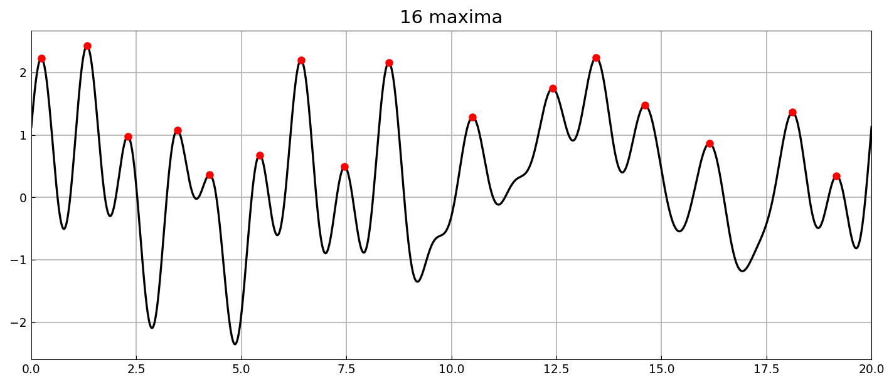
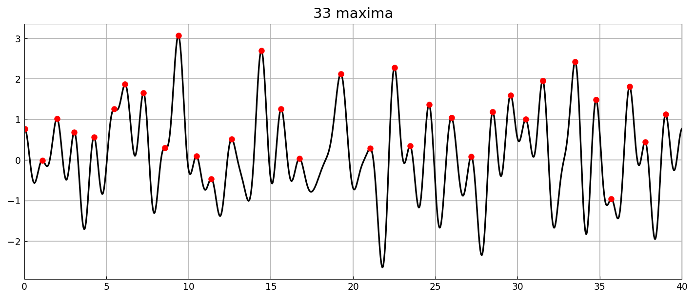
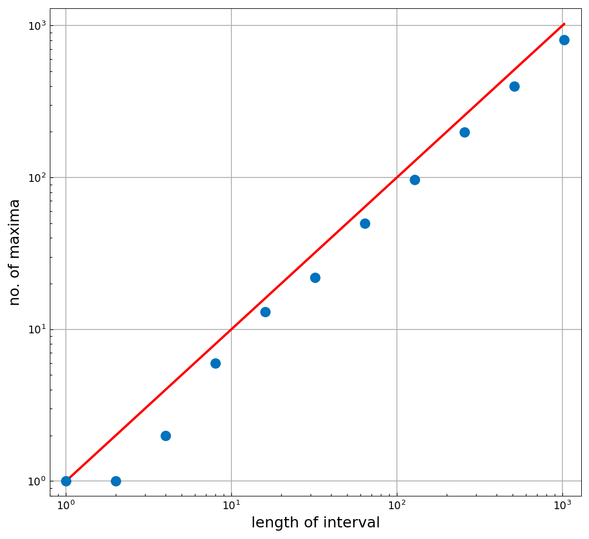

# How many local maxima does a random function have?

*Nick Trefethen, March 2017*

[Original MATLAB Chebfun example](https://www.chebfun.org/examples/stats/RandomMaxima.html)

(Chebfun example stats/RandomMaxima.m)

Take a band-limited random function with wavelength parameter 1 on
$[0, 20]$ and mark its local maxima, found from the roots of the
derivative:



Doubling the interval roughly doubles the count:



Sweeping interval lengths $L = 1, 2, 4, \dots, 1024$ confirms that
the expected number of maxima grows linearly with $L$:



```text
counts: [1, 1, 2, 6, 13, 22, 50, 97, 199, 400, 808]
```

(`randn` draws are not reproducible across systems; the linear growth
is what replicates.)

---

*Replicated with [chebfunjax](https://github.com/ma-gilles/chebfunjax); original
example copyright The University of Oxford and The Chebfun Developers.*
