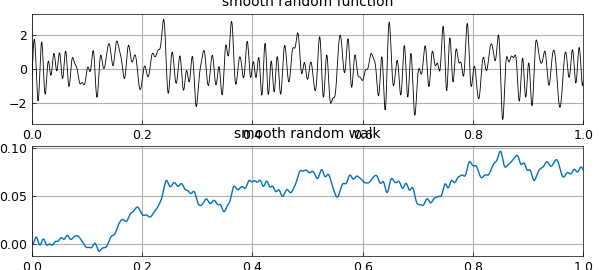
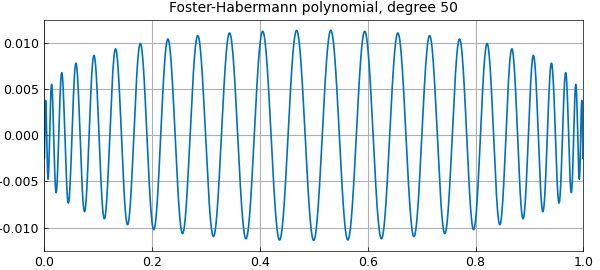
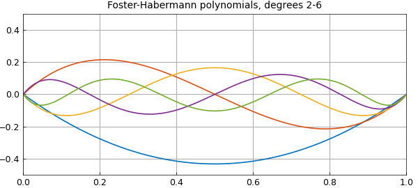
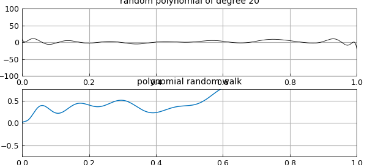
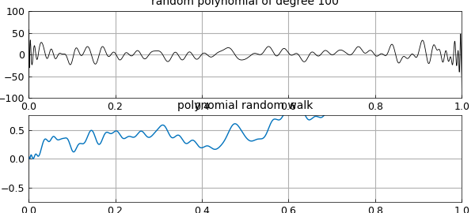
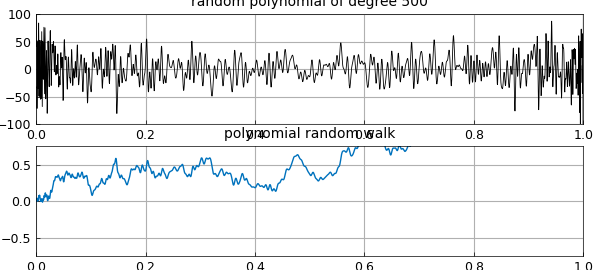
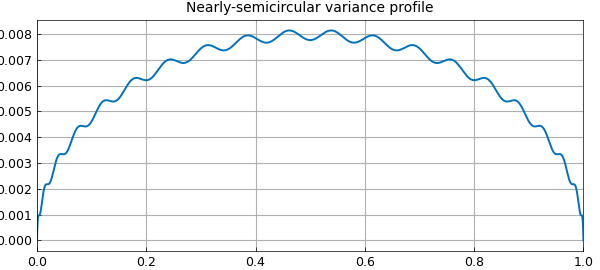

# Brownian paths and random polynomials

*Nick Trefethen, June 2019*

[Original MATLAB Chebfun example](https://www.chebfun.org/examples/stats/RandomPolynomials.html)

Python translation: [`examples/stats/random_polynomials.py`](https://github.com/ma-gilles/chebfunjax/blob/main/examples/stats/random_polynomials.py)

The Chebfun `randnfun(d)` command produces a smooth random function with minimal wavelength $d$, as described in [1], which converges (or rather fails to converge!) to white noise as $d\to 0$. Its integral is a smooth random walk, which converges (properly this time) to Brownian motion as $d\to 0$. Here is an example:

```matlab
rng(1)
r = randnfun(0.01,[0,1]);
LW = 'linewidth';
subplot(2,1,1), plot(r,'k',LW,.6)
grid on, title('smooth random function')
b = cumsum(r);
subplot(2,1,2), plot(b), grid on, title('smooth random walk')
```



All this is done via trigonometric polynomials with random coefficients. (The idea of Fourier series with random coefficients goes back to Norbert Wiener and is treated in a marvelous book by Kahane [4].) A priori, a smooth random function is periodic and given by a distribution that is translation-invariant. In practice we usually want a nonperiodic function, and Chebfun achieves this (with small though in principle nonzero error) by truncation from a longer periodic interval to a shorter nonperiodic one.

One might ask, what are the analogues of these constructions for algebraic as opposed to trigonometric polynomials? An answer to this question has recently been provided in a pair of papers by Foster, et al. [2] and Habermann [3]. We define a *random polynomial of degree $n$* by $$ r(x) = \sum_{k=0}^n c_k \sqrt{2k+1} P_k(x), $$ where $P_k$ is the degree $k$ Legendre polynomial (shifted to $[0,1]$) and the $c_k$ are i.i.d. standard normal random variables. As $n\to\infty$, $r$ does not look like *white* noise, for it has higher frequencies and higher amplitudes near the endpoints than in the middle (examples will be shown in a moment). However, its integral converges to Brownian motion. Using the convenient identity $$ \int_0^t P_k(s) ds = {P_{k+1}(t) - P_{k-1}(t)\over 4k+2} \quad (k\ge 1), $$ we conclude that *polynomial random walk of degree $n$* can be defined by $$ w(t) = c_0 t + \sum_{k=1}^{n-1} c_k {P_{k+1}(t) - P_{k-1}(t) \over \sqrt{8k+4}}. $$ Foster, et al. note that the polynomials in this sum can be interpreted as Jacobi polynomials, except with the nonstandard exponents $-1$, and thus constrained to take the value 0 at both endpoints. Here for example is the degree $50$ "Foster-Habermann polynomial":

```matlab
scaled_legendre = @(n) legpoly(n,[0 1])*diag(sqrt(2*n+1));
foster = @(n) (legpoly(n,[0 1])-legpoly(n-2,[0 1]))*diag(1./sqrt(8*n-4));
clf, plot(foster(50)), grid on
title('Foster-Habermann polynomial, degree 50')
```



The same anonymous functions work for multiple columns. Here, for example, are the Foster-Habermann polynomials of degrees 2 through 6:

```matlab
plot(foster(2:6)), grid on, ylim([-.5 .5])
title('Foster-Habermann polynomials, degrees 2-6')
```



Random polynomials can now be obtained by taking random linear combinations of the scaled Legendre polynomials, and polynomial random walks can be obtained from random linear combinations of the Foster-Habermann polynomials. Here are suitable anonymous functions (we could also have defined `ranwalk` via `cumsum`):

```matlab
ranpoly = @(n) scaled_legendre(0:n)*randn(n+1,1);
t = chebfun('t',[0,1]);
ranwalk = @(n) t*randn + foster(2:n)*randn(n-1,1);
```

Here, for example, are random polynomials of degrees 20, 100, and 500 with their corresponding random walks of degrees 21, 101, and 501:

```matlab
for n = 20*5.^(0:2)
  rng(3)
  subplot(2,1,1), plot(ranpoly(n),'k',LW,.6), ylim([-100 100])
  grid on, title(['random polynomial of degree ' int2str(n)])
  rng(3)
  subplot(2,1,2), plot(ranwalk(n+1)), ylim([-.75 .75])
  grid on, title('polynomial random walk')
  snapnow
end
```







Note that, as usual for polynomials, these shapes are in no sense translation-invariant, having faster oscillations near the endpoints than in the middle. Still, it is proved in [2] and [3] that the polynomial random walks approach Brownian motion as $n\to \infty$. Many other interesting properties are also developed in [2] and [3], concerning polynomial moments, for example, as well as applications to the numerical solution of stochastic differential equations.

How do polynomial random walks of a finite degree $n$ differ from true Brownian motion? The essence of the polynomial construction we have described is that the contributions of different degrees are independent (ultimately since the Legendre polynomials are orthogonal; the argument in [3] for this makes use of the result known as Itô's isometry). It has been shown in [3] that the variance of the difference converges to zero at the rate $O(1/n)$ and approaches a semicircle in profile. An explicit formula involves $t-t^2$ minus the sum of the squares of the Foster-Habermann polynomials. Thus for example, here is the variance of the error process for degree $n=20$:

```matlab
s = chebfun('t-t^2',[0,1]);
for k = 2:20
  s = s - foster(k).^2;
end
clf, plot(s), grid on
title('Nearly-semicircular variance profile')
```



Beautiful!

## References

[1] S. Filip, A. Javeed, and L. N. Trefethen, Smooth random functions, random ODEs, and Gaussian processes, *SIAM Review* 61 (2019), 185--205.

[2] J. Foster, T. Lyons, and H. Oberhauser, An optimal polynomial approximation of Brownian motion, *SIAM J. Numer. Anal.* 58 (2020), 1393-1421.

[3] K. Habermann, A semicircle law and decorrelation phenomena for iterated Kolmogorov loops, *J. LMS* 103 (2021), 558-586.

[4] J.-P. Kahane, *Some Random Series of Functions*, 2nd ed., Cambridge, 1985.

---

*Translated with [chebfunjax](https://github.com/ma-gilles/chebfunjax); prose and MATLAB code from the original example, copyright The University of Oxford and The Chebfun Developers.  Printed outputs and figures are chebfunjax's.*
