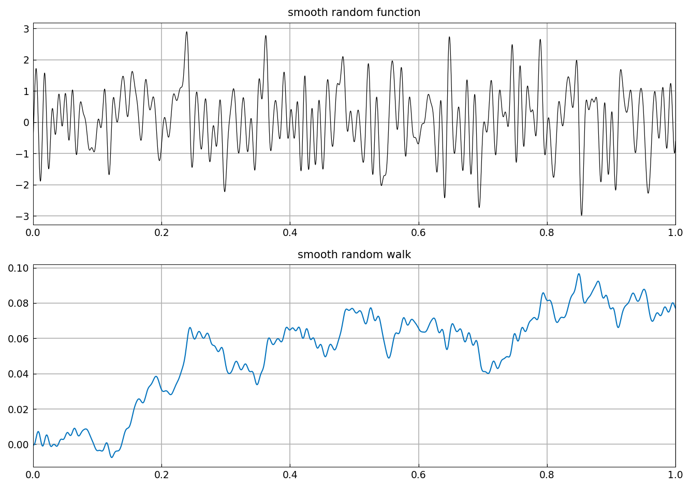
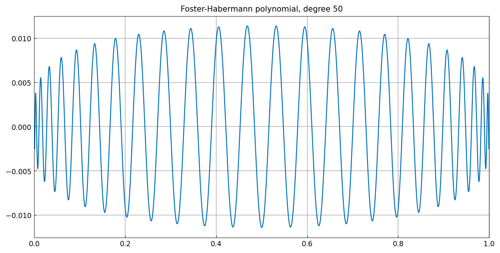
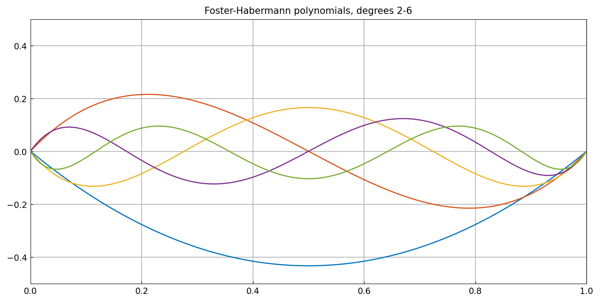
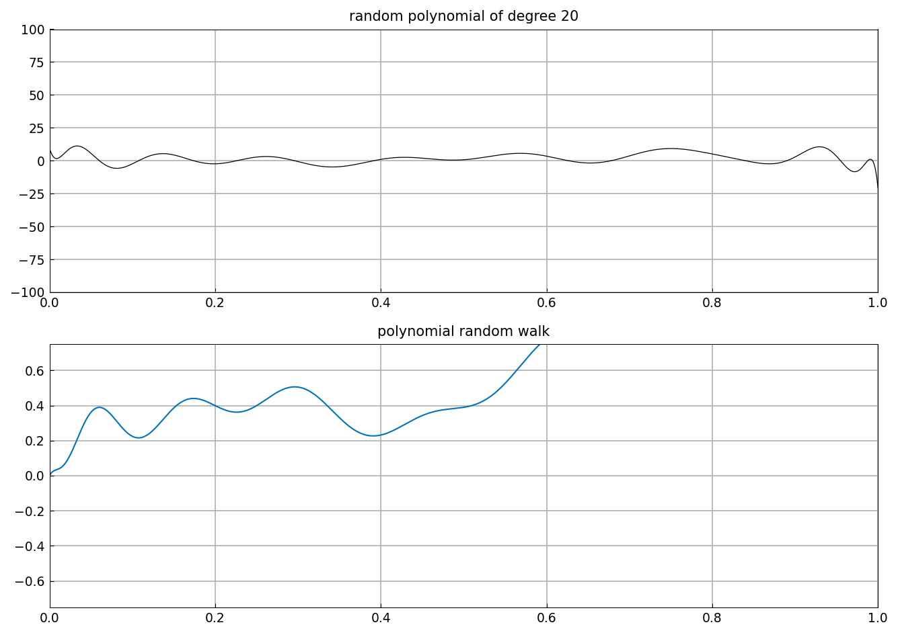
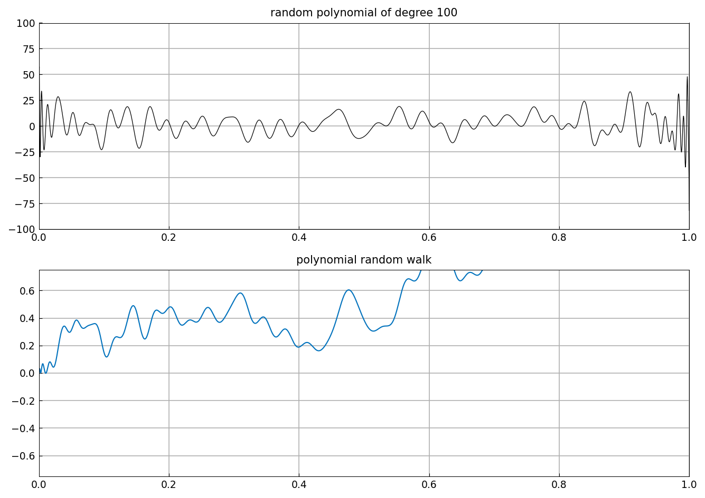
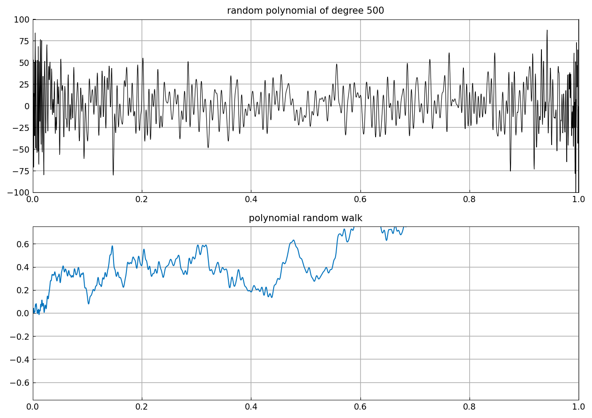
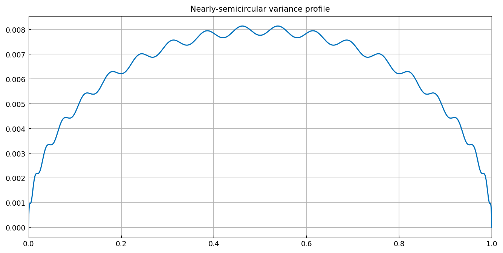

# Random polynomials and random walks

*Nick Trefethen, April 2017*

[Original MATLAB Chebfun example](https://www.chebfun.org/examples/stats/RandomPolynomials.html)

(Chebfun example stats/RandomPolynomials.m)

A smooth random function and its integral, a smooth random walk:

The polynomial analogues use orthonormal bases on $[0,1]$: scaled
Legendre polynomials for white noise, and the *Foster-Habermann*
polynomials $ (P_n - P_{n-2})/\sqrt{8n-4} $ — whose derivative
expansions telescope — for random walks:

Random combinations at degrees 20, 100 and 500: the top rows
approach white noise, the bottom rows approach Brownian paths:

The variance profile $t - t^2 - \sum_{k=2}^{20} F_k^2$ of the
degree-20 walk is nearly semicircular:

(`randn` draws are our own; the limiting behavior replicates.)

---

*Replicated with [chebfunjax](https://github.com/ma-gilles/chebfunjax); original
example copyright The University of Oxford and The Chebfun Developers.*
