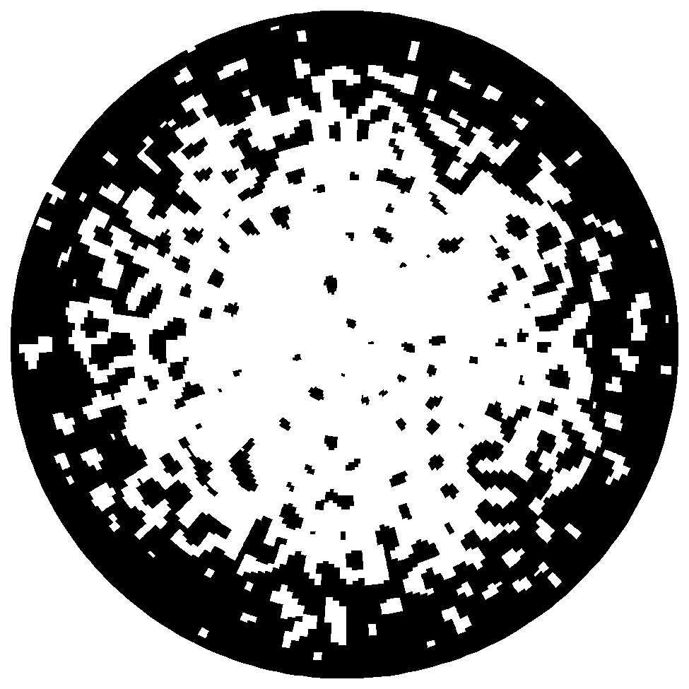
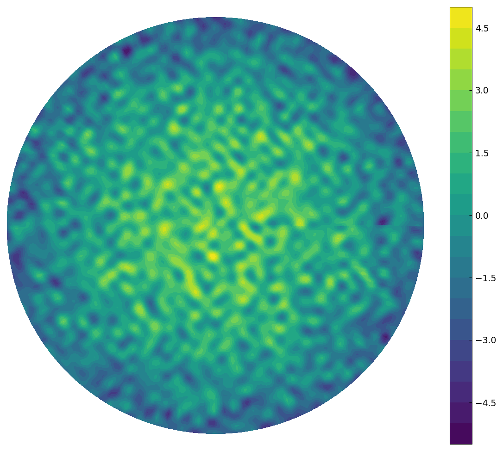
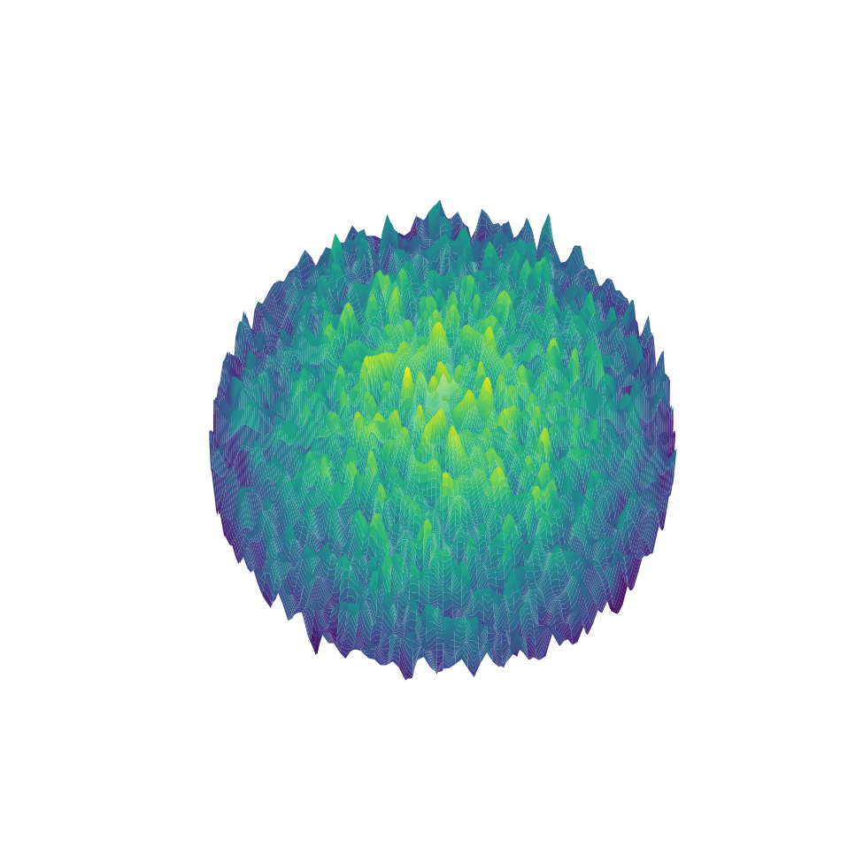

# A random surface on a disk

*Nick Trefethen and Grady Wright, April 2017*

[Original MATLAB Chebfun example](https://www.chebfun.org/examples/stats/RandomSurf.html)

(Chebfun example stats/RandomSurf.m)

A smooth band-limited random function on the unit disk
(`randnfundisk` with wavelength 0.1) added to the paraboloid
$2 - 4r^2$.  The zebra plot shows the sign structure — a white
plateau where the paraboloid dominates, dissolving into speckle where
the random field competes:

The contour plot:

And the surface:

(`randn` draws are not reproducible across systems; the surface is
our own draw from the same family.)

---

*Replicated with [chebfunjax](https://github.com/ma-gilles/chebfunjax); original
example copyright The University of Oxford and The Chebfun Developers.*
