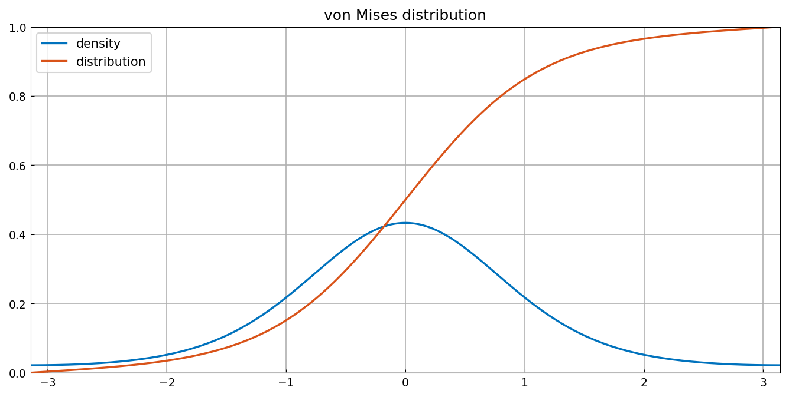
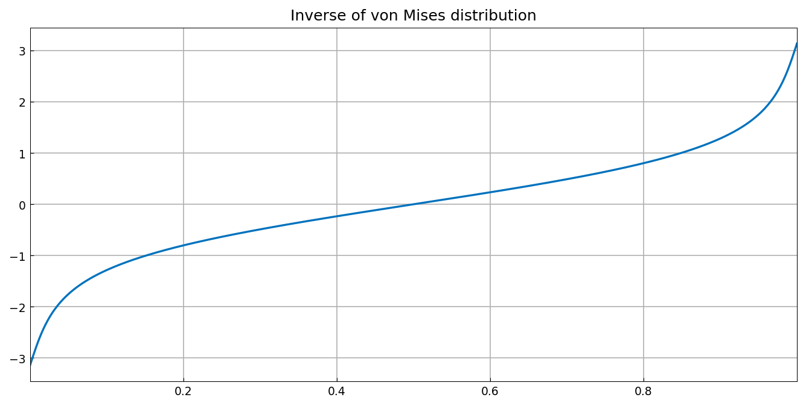
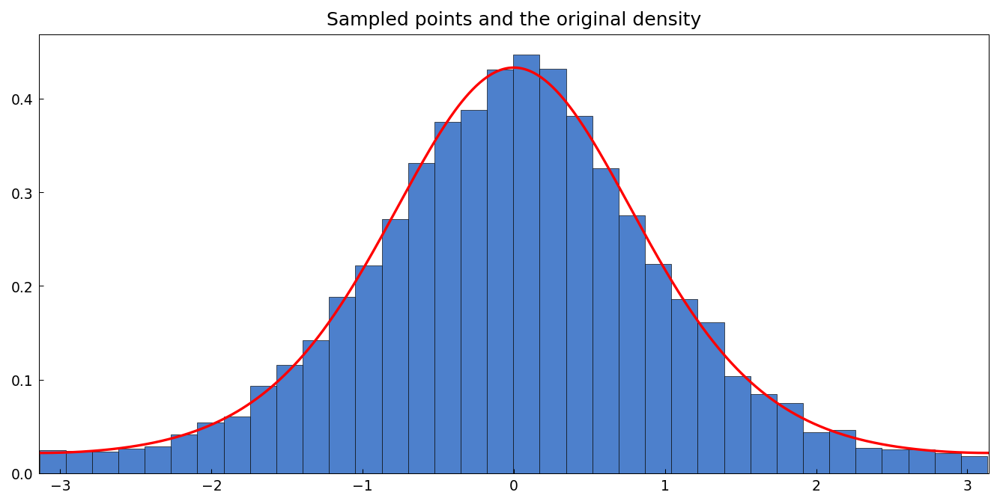
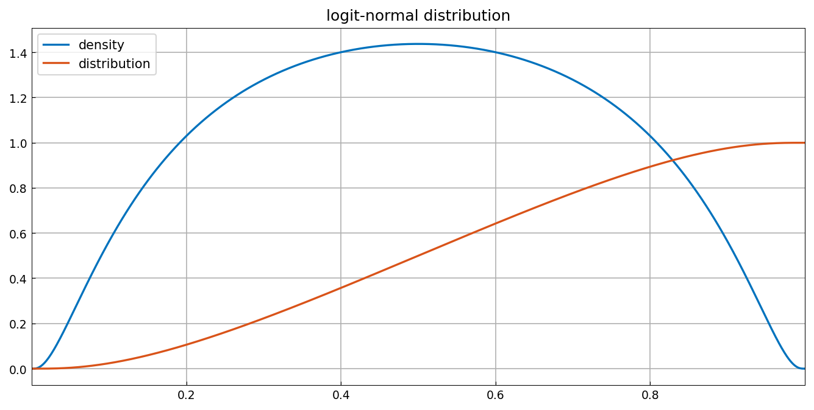
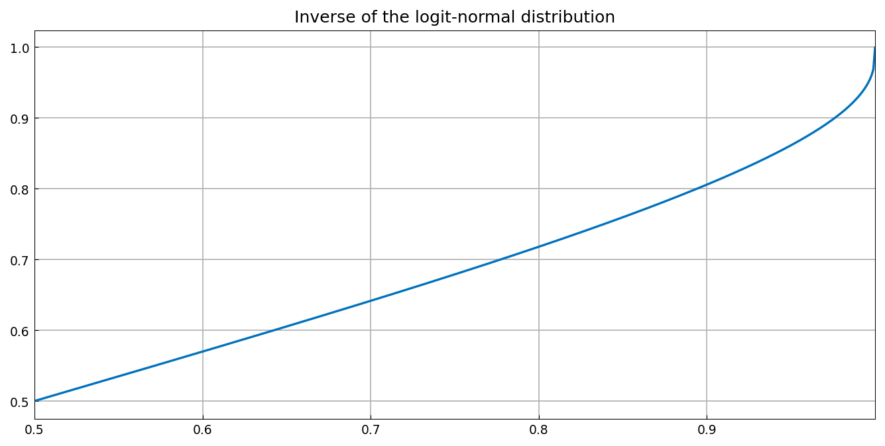
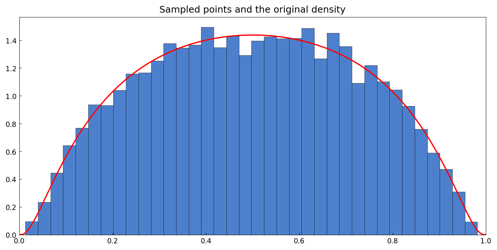

# Resampling random variables

*Toby Driscoll, December 2011*

[Original MATLAB Chebfun example](https://www.chebfun.org/examples/stats/ResamplingRandomVariables.html)

(Chebfun example stats/ResamplingRandomVariables.m)

To sample a nonuniform distribution, apply the inverse of its
cumulative distribution function to uniform samples.  For the von
Mises circular distribution with $\kappa = 1.5$:



The inverse cdf:



Ten thousand transformed uniform samples reproduce the density:



The logit-normal distribution is more challenging: its cdf is
extremely flat near the endpoints, so the inverse is computed on
$[1/2, 1-10^{-3}]$ and extended by symmetry:







The probability mass beyond the truncation point is negligible:

```text
missing =
     2.449569436180354e-10
```

(MATLAB: 2.448851121883422e-10 — the same 2.45e-10 tail deficit.)

---

*Replicated with [chebfunjax](https://github.com/ma-gilles/chebfunjax); original
example copyright The University of Oxford and The Chebfun Developers.*
