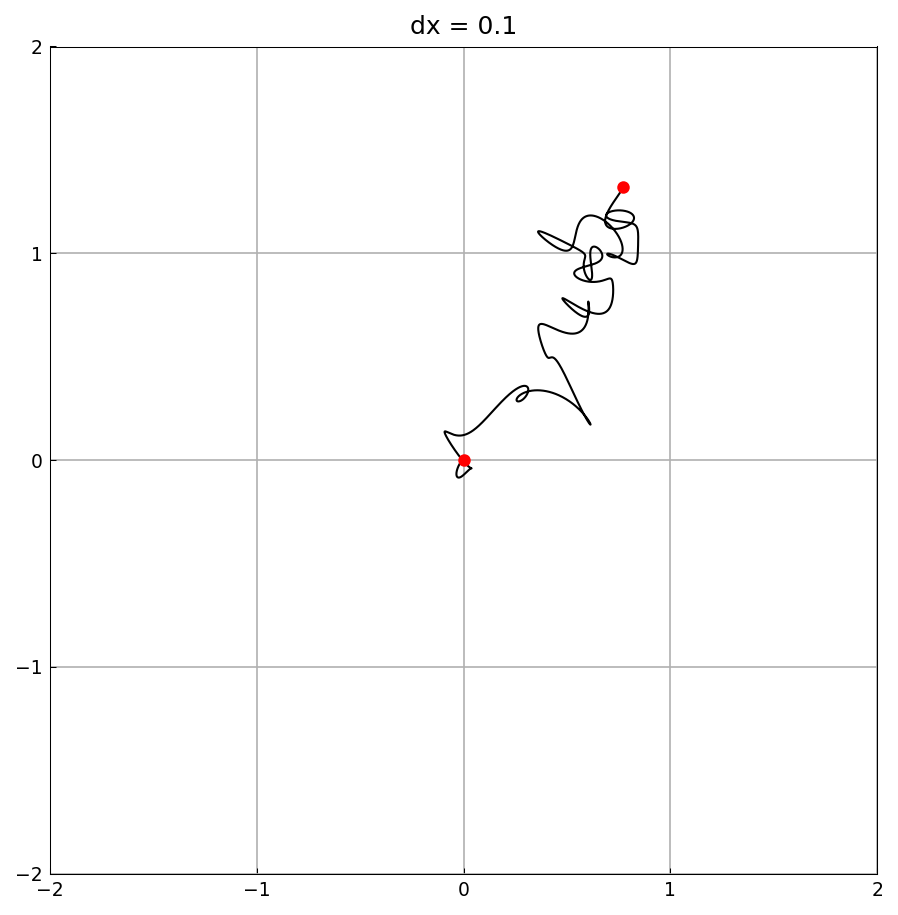
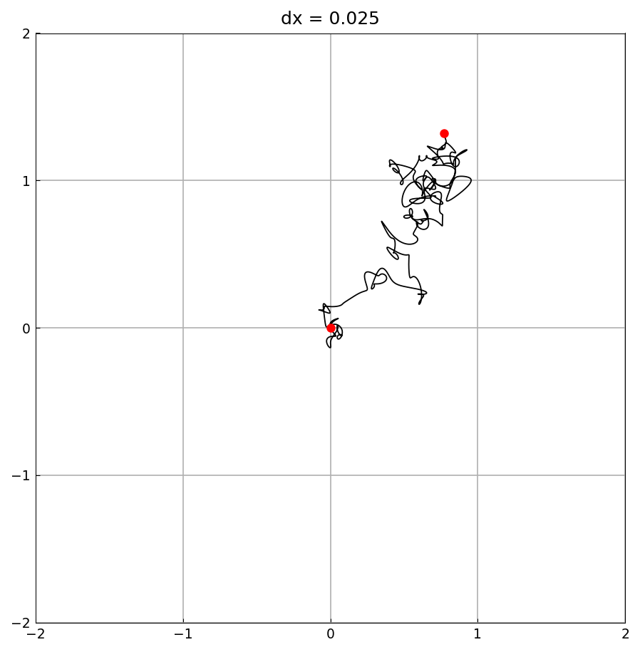
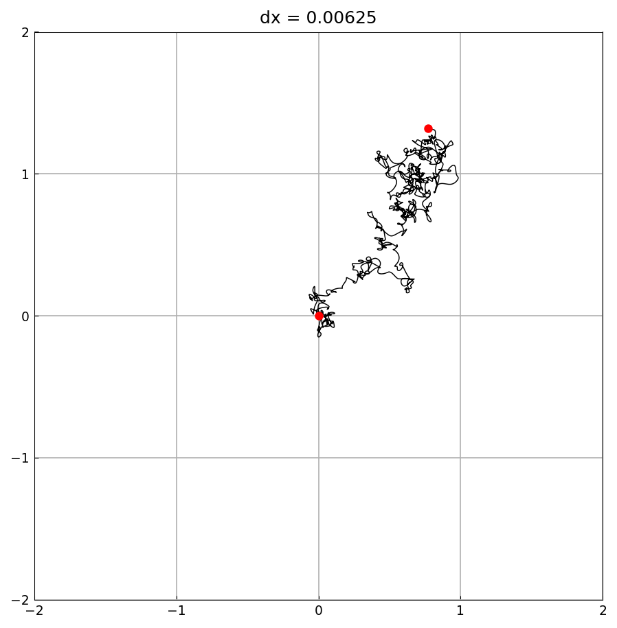

# Smooth random walk

*Nick Trefethen, May 2017*

[Original MATLAB Chebfun example](https://www.chebfun.org/examples/stats/SmoothRandomWalk.html)

(Chebfun example stats/SmoothRandomWalk.m)

Integrating a complex smooth random function (`randnfun` with the
Brownian `'big'` normalization) gives a smooth path in the plane
whose limit, as the wavelength `dx` shrinks, is 2D Brownian motion:

```python
f = randnfun(dx, big=True, cmplx=True)
g = f.cumsum()
```



Dividing `dx` by 4 each time:






Each path is a genuinely smooth (band-limited) function, yet at
`dx = 0.0016` the walk is visually indistinguishable from Brownian
motion.  (`randn` draws are not reproducible across systems, so the
particular paths are our own.)

---

*Replicated with [chebfunjax](https://github.com/ma-gilles/chebfunjax); original
example copyright The University of Oxford and The Chebfun Developers.*
