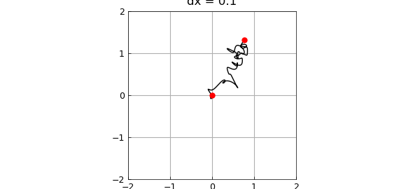
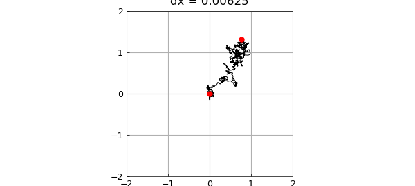
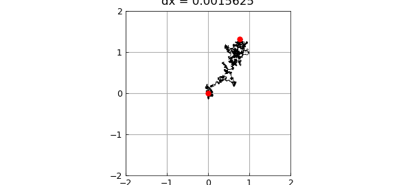

# Smooth random walk

*Nick Trefethen, February 2017*

[Original MATLAB Chebfun example](https://www.chebfun.org/examples/stats/SmoothRandomWalk.html)

Python translation: [`examples/stats/smooth_random_walk.py`](https://github.com/ma-gilles/chebfunjax/blob/main/examples/stats/smooth_random_walk.py)

By integrating coin flips in one or more dimensions, we get a random walk, which becomes Brownian motion in the limit of infinitely many infinitely small steps. Chebfun's `randnfun` command enables us to explore a smooth continuous analogue of this process.

Let's work in 2D, using a complex variable for convenience. Here we plot the indefinite integral of a complex random function scaled by $(dx)^{-1/2}$. Red dots mark the initial and end points.

```matlab
LW = 'linewidth'; MS = 'markersize';
ms = 12;
dx = 0.1;
rng(1), f = randnfun(dx,'big','complex');
g = cumsum(f);
plot(g,'k',LW,1), grid on, hold on
plot(g([-1 1]),'.r',MS,ms), hold off
axis([-1.5 .5 -.5 1.5]), axis square
title(['dx = ' num2str(dx)])
set(gca,'xtick',-2:2,'ytick',-2:2)
```



We divide the characteristic length defining the random function by 4 three times. The limit of Brownian motion is being approached. For details, see [1].

```matlab
for k = 1:3
  dx = dx/4;
  rng(1), f = randnfun(dx,'big','complex');
  g = cumsum(f);
  plot(g,'k',LW,1-.15*k), grid on, hold on
  plot(g([-1 1]),'.r',MS,ms), hold off
  axis([-1.5 .5 -.5 1.5]), axis square
  title(['dx = ' num2str(dx)])
  set(gca,'xtick',-2:2,'ytick',-2:2), snapnow
end
```






[1] S. Filip, A. Javeed, and L. N. Trefethen, Smooth random functions, random ODEs, and Gaussian processes, *SIAM Rev.* 61 (2019), 185-205.

---

*Translated with [chebfunjax](https://github.com/ma-gilles/chebfunjax); prose and MATLAB code from the original example, copyright The University of Oxford and The Chebfun Developers.  Printed outputs and figures are chebfunjax's.*
