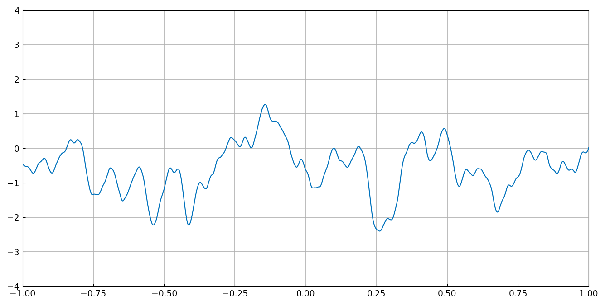
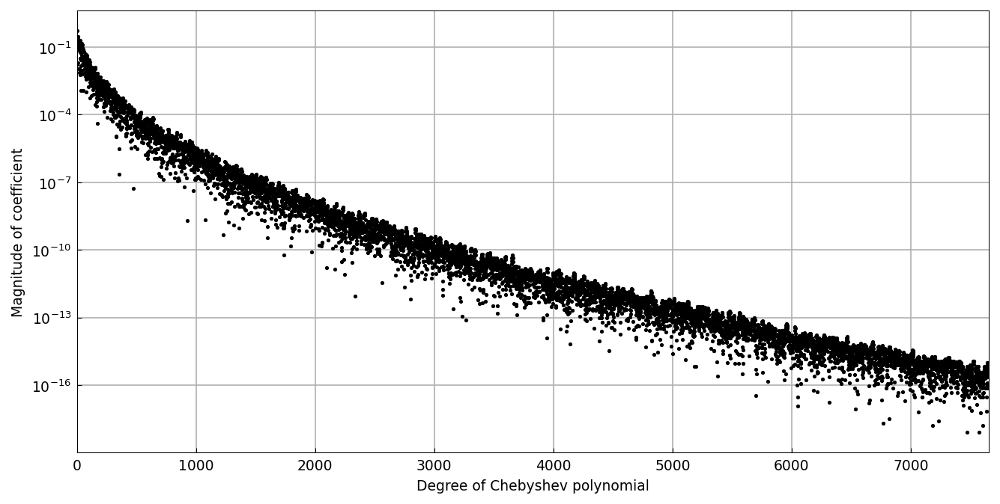
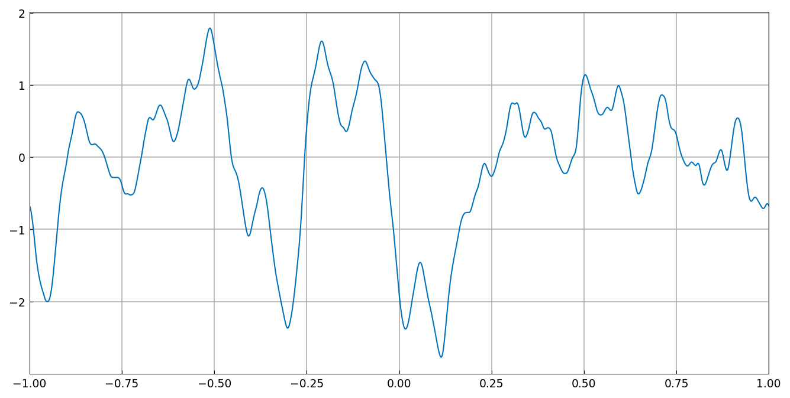
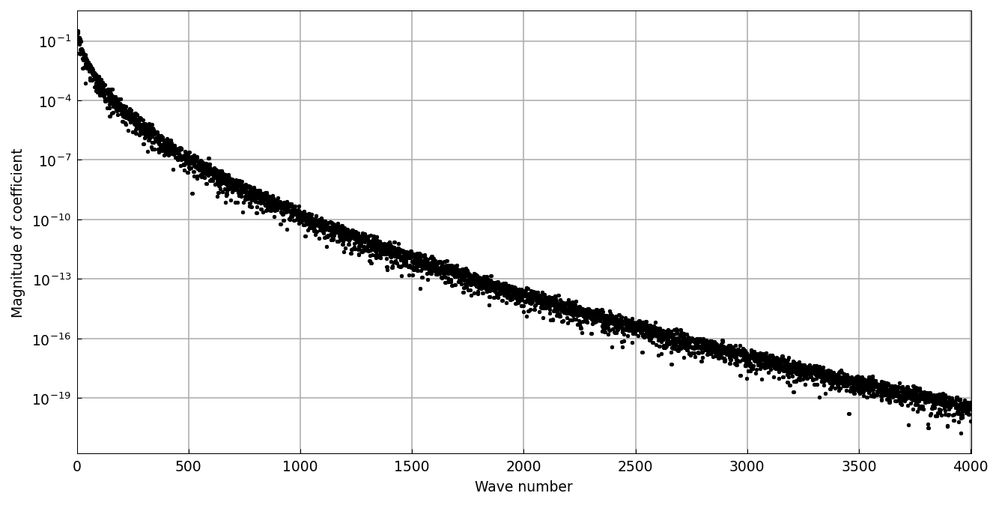
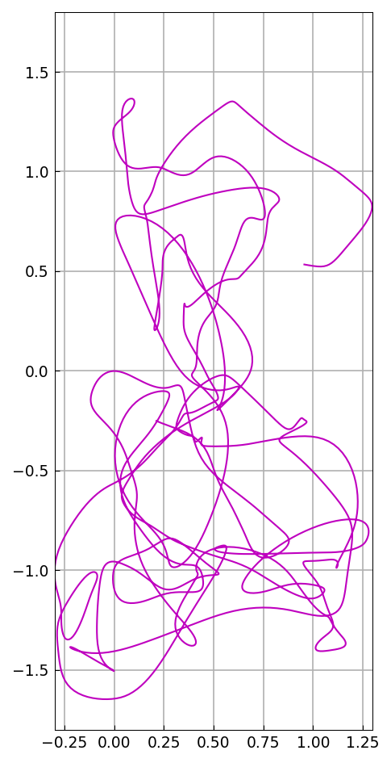
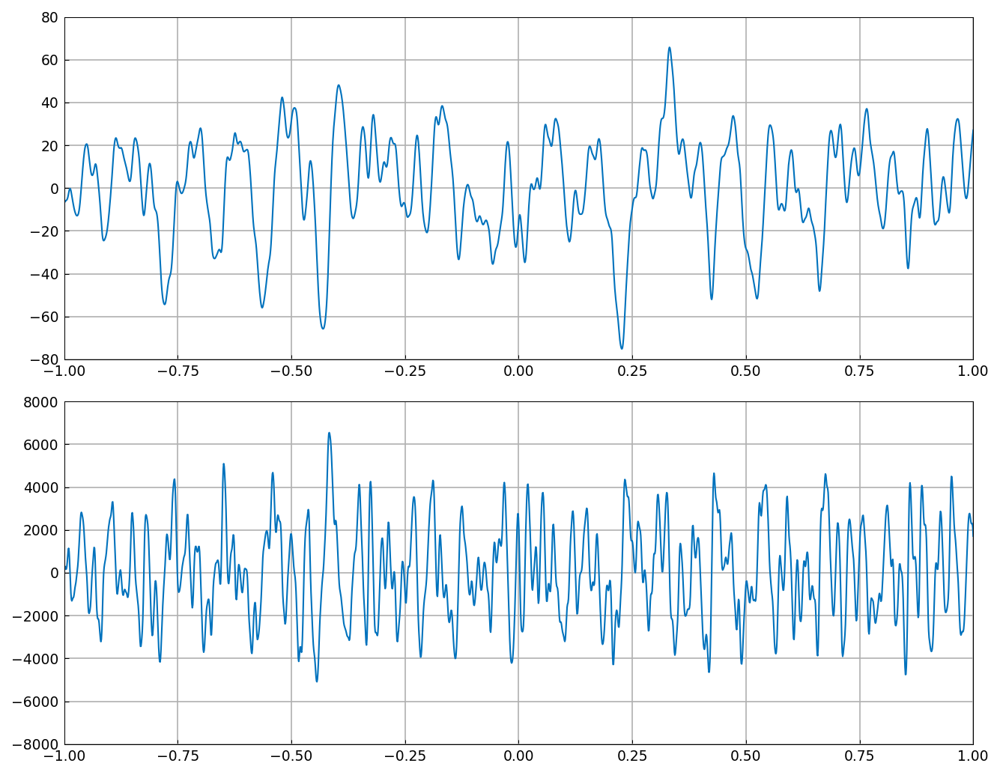

# Smoothies: nowhere-analytic functions

*Nick Trefethen, May 2020*

[Original MATLAB Chebfun example](https://www.chebfun.org/examples/stats/Smoothies.html)

(Chebfun example stats/Smoothies.m)

A *smoothie* is a random function that is $C^\infty$ but nowhere
analytic: a random Fourier series whose coefficients decay
root-exponentially — fast enough for infinite differentiability, too
slowly for analyticity.

The Chebyshev coefficients show clean root-exponential decay:

A periodic smoothie and its (two-sided) Fourier coefficients:

A complex smoothie traces a nowhere-analytic curve in the plane:

Derivatives of a smoothie are smoothies too, growing roughly like
the powers of the wavenumber — here the first and second
derivatives:

(`randn` draws are not reproducible across systems; the smoothies are
our own draws from the same distribution.)

---

*Replicated with [chebfunjax](https://github.com/ma-gilles/chebfunjax); original
example copyright The University of Oxford and The Chebfun Developers.*
