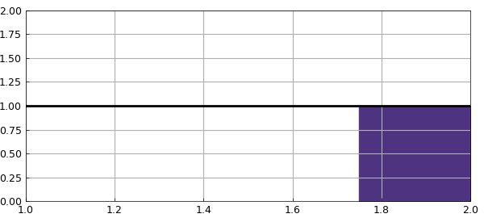
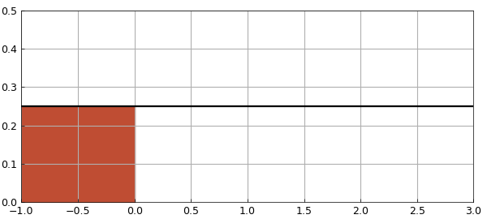
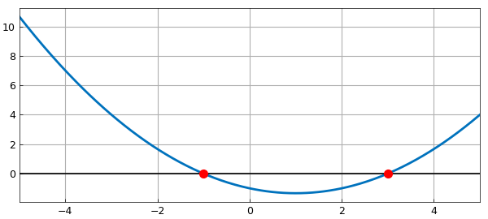
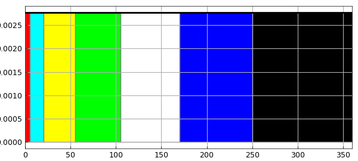
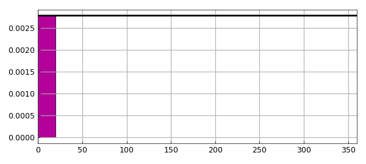
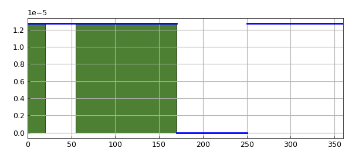

# Uniform distribution: Exercises from a textbook

*Jie Gao, July 2013*

[Original MATLAB Chebfun example](https://www.chebfun.org/examples/stats/UniformExercises.html)

Python translation: [`examples/stats/uniform_exercises.py`](https://github.com/ma-gilles/chebfunjax/blob/main/examples/stats/uniform_exercises.py)

## 1. Introduction

Probability and statistics textbooks contain many exercise problems concerning various probability distributions. In this Example we use Chebfun to solve two problems involving the uniform distribution from the textbook [1]. The domain is a finite interval. Other similar Examples look at problems from the same book involving the normal, beta, exponential, gamma, Rayleigh, and Maxwell distributions.

Like most textbooks, [1] emphasizes problems that can be solved on paper and don't need numerical tools such as Chebfun. As soon as one varies the problem a little, however, numerical solutions often become necessary. Thus first we solve the problems as written, and then we show an application.

## 2. Problem 1(c), page 124

> If $X$ is uniformly distributed over $(1,2)$, find $z$ such that $P[X>z+\mu_x]=1/4$.

We first define the probability density function (PDF) of $X$ as follows:

```matlab
f = chebfun(@(x) 1/(2-1)+0*x, [1 2]);
```

The cumulative density function (CDF) of $X$ is the indefinite integral of $f$:

```matlab
fint = cumsum(f);
```

We can compute the mean of $X$, denoted $\mu_x$, like this:

```matlab
format long
mu_x = sum(chebfun(@(x) x.*f(x), [1 2]))
```

```text
mu_x =
   1.500000000000000
```

This is obviously correct.

Let $a = z+\mu_x$. Since $P[X>a] = 1/4$, we can find $a$ like this:

```matlab
a = roots(1-fint-1/4)
```

```text
a =
   1.750000000000000
```

Then we know the value of $z$:

```matlab
z = a-mu_x
```

```text
z =
   0.250000000000000
```

We now plot the PDF of this uniform distribution and the probability $P[X>z+\mu_x] = 1/4$:

```matlab
hold off, h = area(f{a, 2});
set(h,'FaceColor',[0.3 0.2 0.5]), xlim([1 2]), ylim([0, 2])
LW = 'linewidth';
hold on, plot(f,'k',LW,2), grid on
```



## 3. Problem 1(m), page 124

> Suppose $X$ is a continuous random variable with uniform distribution having mean $1$ and variance $4/3$. What is $P[X<0]$?

The probability density function (PDF) of the uniform distribution can be defined like this: $f = 1/(b-a)$ for $x \in (a,b)$.

Then the mean is $(a+b)/2$ and the variance is $(b-a)^2/12$. We want to solve for $a$ and $b$ given the stated conditions on the mean and variance.

One approach would be to use Chebfun2. We can do that like this:

```matlab
mean = 1;
var  = 4/3;
```

Let us assume that the roots are within a square of side length $10$ centered at the origin

```matlab
f = chebfun2( @(a,b) (a+b)/2 - mean, [-5,5,-5,5] );
g = chebfun2( @(a,b) (b-a).^2/12 - var,  [-5,5,-5,5] );
```

The common roots of $f$ and $g$ are the points where the mean and the variance attain the desired values.

```matlab
r = roots( f, g )
```

```text
r =
   -1.000000000000000   3.000000000000000
    3.000000000000000  -1.000000000000000
```

We then get two pairs of values for $a$ and $b$. Since $a < b$, we can easily make the right choice of the $(a,b)$ pair and discard the other one. As we can see $a = -1$ and $b = 3$ are the correct choices.

```matlab
a = min(r(2,:))
b = max(r(2,:))
```

```text
a =
  -1.000000000000000
b =
   3.000000000000000
```

Now we have the PDF of $X$ as follows:

```matlab
f = chebfun(@(x)0*x + 1/(b-a),[a, b]);
```

The cumulative density function (CDF) is the indefinite integral of $f$:

```matlab
fint = cumsum(f);
```

$P[X<0]$ is this integral evaluated at $0$:

```matlab
p = fint(0)
```

```text
p =
   0.250000000000000
```

Let us plot $f$ on the interval $[a, b]$ and the region $x<0$.

```matlab
hold off, h = area(f{a, 0});
set(h,'FaceColor',[0.75 0.3 0.2]), xlim([a, b]), ylim([0, 0.5])
LW = 'linewidth';
hold on, plot(f,'k',LW,1.6), grid on
```



Alternatively, let us find $a$ and $b$ with Chebfun. One approach is to eliminate $b$ by hand and then use Chebfun's `roots` command to find $a$.

We express $b$ in terms of $a$ according to $mean = (a+b)/2 = 1$:

```matlab
b = @(a) 2-a
```

```text
(no matching output)
```

By $variance = (b-a)^2/12 = 4/3$, we can try $a$ in the interval $[-5,5]$ to see if we get a root for the function $g$ defined as:

```matlab
g = chebfun(@(a) (b(a)-a).^2/12 -4/3, [-5,5]);
aa = roots(g)
```

```text
aa =
  -1.000000000000000
  3.000000000000000
```

As before, we can see $a = -1$ and $b = 3$ are the correct choices.

```matlab
a = aa(1)
b = aa(2)
```

```text
(no matching output)
```

Let us plot $f$ on the interval $[-5,5]$, the two roots $a$ and $b$:

```matlab
hold off, plot(g, LW, 2),
hold on, plot([-5,5],[0,0], '-k'), axis auto
plot(aa, g(a), 'r.', 'markersize', 20)
grid on
```



Another Chebfun approach would be to solve for both $a$ and $b$ using Chebfun2.

Let us define the mean of the distribution like this:

```matlab
meanab = chebfun2(@(a, b) (a+b)/2, [-5, 5, -5, 5]);
```

Similarly, we can define the variance like this:

```matlab
varab = chebfun2(@(a, b) (b-a).^2/12, [-5, 5, -5, 5]);
```

We can solve for $a$ and $b$ simultaneously as follows:

```matlab
ab = roots(meanab-1, varab-4/3)
```

```text
(no matching output)
```

As there are two pairs of $a$ and $b$ listed in `ab`, we need to identify the correct pair:

```matlab
a = ab(1, 2)
b = ab(1, 1)
```

```text
(no matching output)
```

## 4. Application adapted from Example 12, page 107

> In a lottery draw, we let a participant spin a wheel and allow it to come to rest. The wheel is partitioned into ordered sectors: red ($5^\circ$), cyan ($15^\circ$), yellow ($35^\circ$), green ($50^\circ$), white ($65^\circ$), blue ($80^\circ$), black ($110^\circ$). Each color represents a prize. When the wheel comes to rest, a fixed arrow on the circumference points to a color. The participant then receives the prize that the corresponding color stands for. We can see that the point on the circumference of the wheel that is located opposite the fixed arrow could be considered as the value of a random variable $X$ that is uniformly distributed over the circumference of the wheel.

> (Q1) What is the probability of a participant receiving a prize represented by red or cyan?

The PDF of $X$ can be defined like this:

```matlab
f = chebfun(@(x) 1/(360-0)+0*x, [0 360]);
```

Let us plot the composition of the wheel:

```matlab
FC = 'Facecolor';
hold off, h1 = area(f{0, 5}); set(h1,FC,[1 0 0]), axis auto
hold on, h2 = area(f{5, 20}); set(h2,FC,[0 1 1]),
h3 = area(f{20, 55}); set(h3,FC,[1 1 0]),
h4 = area(f{55, 105}); set(h4,FC,[0 1 0]),
h5 = area(f{105, 170}); set(h5,FC,[1 1 1]),
h6 = area(f{170, 250}); set(h6,FC,[0 0 1]),
h7 = area(f{250, 360}); set(h7,FC,[0 0 0]),
plot(f,'k',LW,2), grid on
```



The CDF of $X$ is thus:

```matlab
fint = cumsum(f);
```

We can compute the probability of $0<X<(5+15)$ like this:

```matlab
p1 = fint(5+15)
```

```text
p1 =
   0.055555555555556
```

Let us compare `p1` to the exact value obtained by simple algebra:

```matlab
p1_exact = (5+15)/360
```

```text
p1_exact =
   0.055555555555556
```

Now we plot the probability:

```matlab
hold off, plot(f,'k',LW,2), grid on
hold on, h = area(f{0, 20}); set(h,FC,[0.7 0 0.6]),
xlim([0 360])
```



> (Q2) We now know that the arrow will not point to the blue region when the wheel comes to rest. Under this condition, what is the probability that it will point to neither black nor yellow?

Because $X$ is uniformly distributed, the probability of the arrow not pointing to the blue region is:

```matlab
pnb = 1-fint(80)
```

```text
pnb =
   0.777777777777778
```

Similarly, the probability of the arrow not pointing to either the yellow or black region is:

```matlab
pnyb = 1-fint(35)-fint(110)
```

```text
pnyb =
   0.597222222222222
```

So the probability of the arrow not pointing to any of yellow, black, or blue is:

```matlab
pn = pnyb-fint(80)
```

```text
pn =
   0.375000000000000
```

By Bayes' Theorem, the conditional probability can be computed as follows:

```matlab
p2 = pn/pnb
```

```text
p2 =
   0.482142857142857
```

As before, we can compare `p2` to the exact value of the conditional probability obtained by simple algebra:

```matlab
p2_exact = (1-(35+110+80)/360)/(1-80/360)
```

```text
p2_exact =
   0.482142857142857
```

Now let us plot the conditional probability:

```matlab
g= f/(280/360);
g = g.*chebfun({g,0,g}, [0, 170, 250, 360]);
hold off, h1 = area(g{0, 20}); set(h1,FC,[0.3 0.5 0.2]),
hold on, h2 = area(g{55, 170}); set(h2,FC,[0.3 0.5 0.2]),
plot(g,'b',LW,2), xlim([0 360]), grid on
```



## References

1. A. M. Mood, F. A. Graybill, and D. Boes, *Introduction to the Theory of Statistics*, McGraw-Hill, 1974.

---

*Translated with [chebfunjax](https://github.com/ma-gilles/chebfunjax); prose and MATLAB code from the original example, copyright The University of Oxford and The Chebfun Developers.  Printed outputs and figures are chebfunjax's.*
