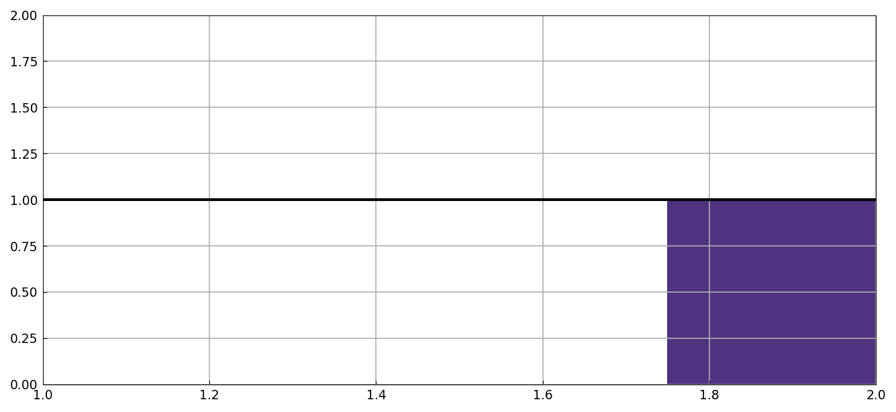
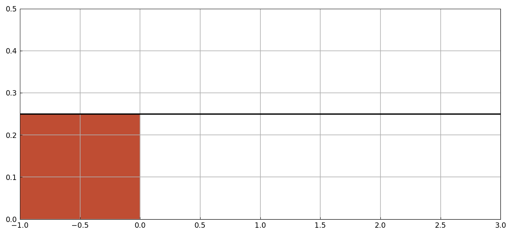
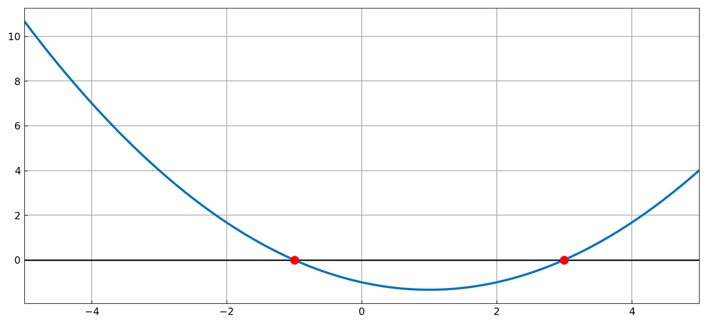
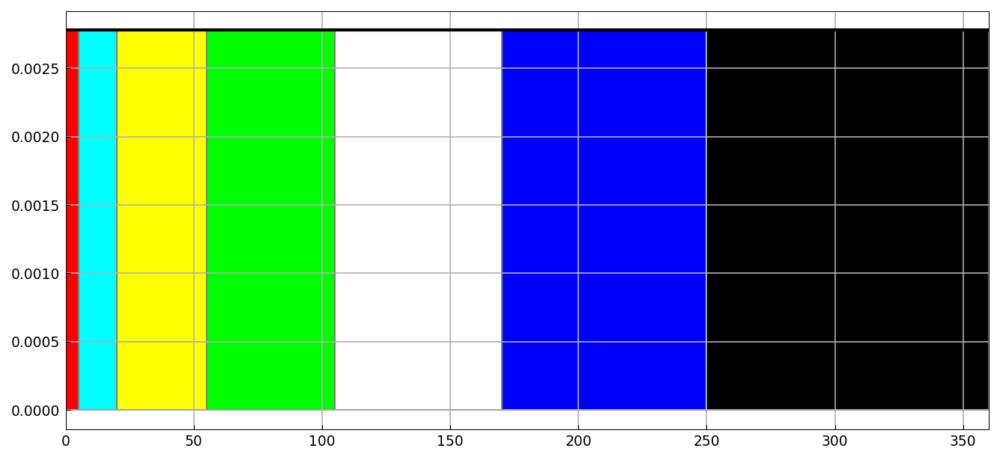

# Probability exercises: uniform distributions

*Jie Gao and Nick Trefethen, June 2013*

[Original MATLAB Chebfun example](https://www.chebfun.org/examples/stats/UniformExercises.html)

(Chebfun example stats/UniformExercises.m)

For a uniform density on $[1,2]$, the mean and the third quartile
come from chebfun sums and roots:

```text
mu_x =
   1.500000000000000
a =
   1.750000000000000
z =
   0.250000000000000
```



Given mean 1 and variance 4/3, the endpoints $(a,b)$ of the uniform
distribution solve two equations — found as chebfun2 common roots:

```text
r =
   -1.000000000000000   3.000000000000000
    3.000000000000000  -1.000000000000000
p =
   0.250000000000000
```



or by 1D substitution $b = 2-a$:



Finally the wheel-of-fortune problem — a uniform angle on
$[0,360]$ with colored sectors:



```text
p1 =
   0.055555555555556
pnb =
   0.777777777777778
pnyb =
   0.597222222222222
pn =
   0.375000000000000
p2 =
   0.482142857142857
p2_exact =
   0.482142857142857
```

(All outputs digit-for-digit with the published MATLAB run.)

---

*Replicated with [chebfunjax](https://github.com/ma-gilles/chebfunjax); original
example copyright The University of Oxford and The Chebfun Developers.*
