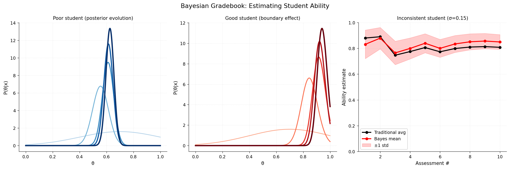

# Bayesian Gradebook

**Original:** [stats/BayesianGradebook](https://www.chebfun.org/examples/stats/BayesianGradebook.html)
**Author(s):** Nick Trefethen, September 2014

---

Bayesian posterior updating: each grade updates the distribution over true grade.

## Code

```python
from examples.stats.bayesian_gradebook import run
run()
```

## Output


