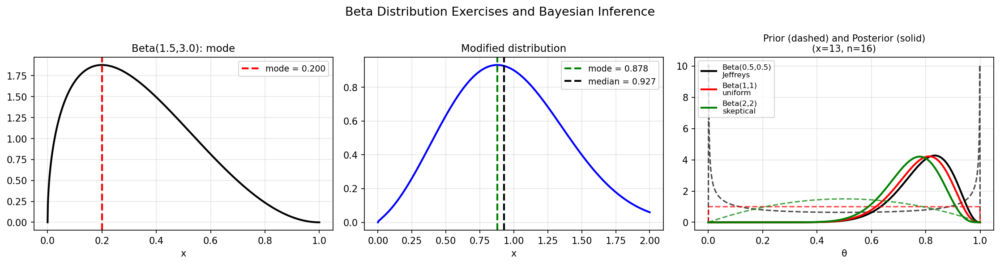

# Beta Distribution Exercise

**Original:** [stats/BetaExercise](https://github.com/chebfun/examples/blob/master/stats/BetaExercise.m)
**Author(s):** Jie Gao, July 2013

---

Probability and statistics textbooks contain many exercise problems concerning
various probability distributions. This example uses Chebfun to solve a problem
involving the beta distribution from the textbook [1]. The beta distribution is
a family of probability densities on the interval $(0,1)$ that can model a
variety of shapes.

## Finding the mode of a beta distribution

The probability density function of the beta distribution is

$$f(x; a, b) = \frac{x^{a-1}(1-x)^{b-1}}{B(a,b)},$$

where $B(a,b) = \int_0^1 x^{a-1}(1-x)^{b-1}\,dx$ is the beta function and
$a, b > 0$ are shape parameters.

For $a = 1.5$ and $b = 3$, the mode -- the value of $x$ that maximizes the
PDF -- can be found numerically. The exact formula is

$$\text{mode} = \frac{a-1}{a+b-2} = 0.2.$$

The density is skewed because $a \neq b$.

## Numerical variant

In a variant problem, we replace the standard beta distribution with a modified
density on $[0,2]$ involving logarithmic and exponential powers:

$$g(x) \propto \left(\tfrac{x}{2}\right)^{\log(a)} \left(2 - \tfrac{x}{2}\right)^{e^{b-1}\sqrt{x}}.$$

After normalization, the mode and median are computed numerically. The median
$m$ satisfies $P[X < m] = 1/2$ and is found by inverting the cumulative
distribution function. For this modified distribution, the mode and median turn
out to be very close, and the PDF resembles a normal distribution.

## Application in Bayesian inference

Beta distributions serve as natural prior distributions for binomial,
geometric, and Bernoulli likelihoods. Given a prior $h(\theta)$ that is
$\mathrm{Beta}(a, b)$ and observing $x$ successes in $n$ trials, the posterior
is $\mathrm{Beta}(x + a,\, n - x + b)$ by conjugacy.

To compare hypotheses $H_0\colon \theta \ge 0.6$ vs. $H_1\colon \theta < 0.6$,
we compute **prior odds** and **posterior odds** under three priors:

| Prior | Prior odds | Posterior odds | Bayes factor |
|---|---|---|---|
| Beta(0.5, 0.5) -- Jeffreys' prior | 0.773 | 26.61 | 34.43 |
| Beta(1, 1) -- uniform prior | 0.667 | 20.54 | 30.81 |
| Beta(2, 2) -- skeptical prior | 0.543 | 13.37 | 24.60 |

With $x = 13$ successes out of $n = 16$ trials, all three Bayes factors fall
between 20 and 150, indicating strong evidence for $H_0$.

## References

1. A. M. Mood, F. A. Graybill, and D. Boes, *Introduction to the Theory of
   Statistics*, McGraw-Hill, 1974.
2. N. Laws, Part A Statistics: Bayesian Inference, Hilary Term 2013.
3. N. Laws, Example from Carlin and Louis (2008), Bayesian Inference.

```python
from examples.stats.beta_exercise import run
run()
```

## Output


