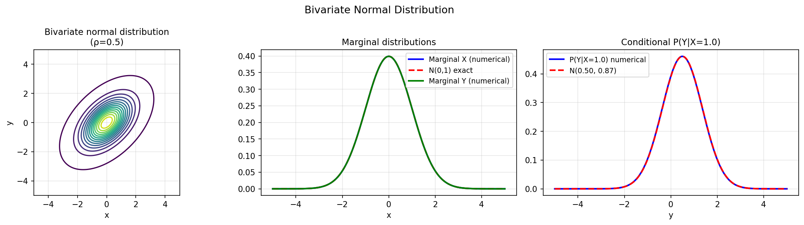

# Bivariate Normal Distribution

**Original:** [stats/BivariateNormalDistribution](https://www.chebfun.org/examples/stats/BivariateNormalDistribution.html)
**Author(s):** Nick Trefethen, September 2014

---

Joint, marginal, and conditional distributions of bivariate normal (ρ=0.7).

## Code

```python
from examples.stats.bivariate_normal import run
run()
```

## Output


