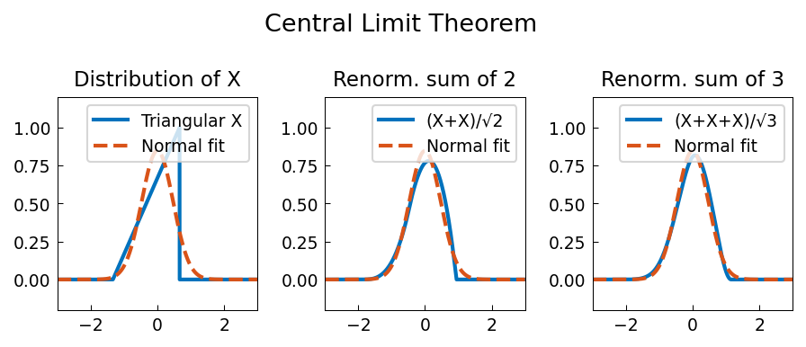

# Central Limit Theorem

**Original:** [stats/CentralLimitTheorem](https://www.chebfun.org/examples/stats/CentralLimitTheorem.html)
**Author(s):** Nick Trefethen and Mohsin Javed, July 2012

---

The Central Limit Theorem is one of the most striking results in probability
theory. It says that if you take the mean of $n$ independent samples from
almost any random variable, the distribution of these means approaches a normal
distribution as $n \to \infty$.

## Mathematical statement

Let $X_1, \dots, X_n$ be independent samples from a distribution with mean
$\mu$ and variance $\sigma^2 < \infty$, and consider the sample mean

$$S_n = n^{-1} \sum_{k=1}^n X_k.$$

The law of large numbers asserts that $S_n \to \mu$ almost surely as
$n \to \infty$. The Central Limit Theorem strengthens this: the random
variables $\sqrt{n}(S_n - \mu)$ converge in distribution to $N(0, \sigma^2)$.

## Convolution of a triangular distribution

The probability distribution for the sum of independent random variables is
given by a convolution. Starting with a triangular distribution on $[-4/3, 2/3]$
with mean zero and variance $2/9$, we can visualize convergence to the Gaussian
by repeatedly convolving the distribution with itself.

After renormalizing each sum so the variance remains $2/9$:

- The **original** triangular distribution looks nothing like a bell curve.
- The sum of **two copies** already shows smoother, more bell-like shape.
- The sum of **three copies** is nearly indistinguishable from the Gaussian with
  the same mean and variance.

## Discrete example: binomial distribution

The CLT also applies to discrete distributions. Consider a coin with probability
$p = 0.6$ of heads. The PDF of a single toss is a pair of Dirac delta impulses
at $x = 0$ and $x = 1$ with weights $1 - p$ and $p$.

Convolving this distribution with itself $n$ times yields the binomial
distribution of order $n$. For $n = 10$ tosses, the binomial distribution
matches the normal distribution $N(np,\, np(1-p))$ quite well, with $\mu = 6$
and $\sigma \approx 1.55$.

Even for the modest value $n = 10$, the fit is already convincing. While
computing binomial distributions via Chebfun convolution of delta functions is
extraordinarily inefficient, it illustrates the generality of the framework
for more complex problems mixing discrete and continuous components.

## References

1. A. Papoulis, *Probability, Random Variables and Stochastic Processes*,
   3rd edition, McGraw-Hill, 1991.

```python
from examples.stats.central_limit_theorem import run
run()
```

## Output


