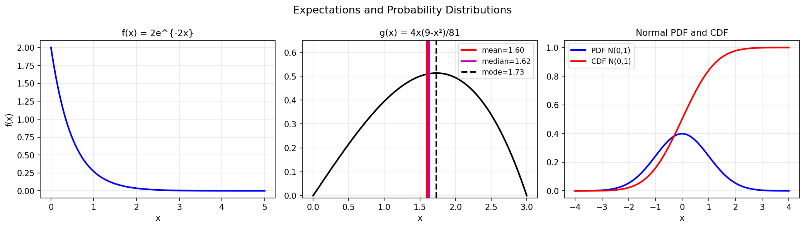

# Expectations of Distributions

**Original:** [stats/Expectations](https://www.chebfun.org/examples/stats/Expectations.html)
**Author(s):** Nick Trefethen, July 2012

---

Mean, median, mode, variance, and skewness of normal, beta, and gamma distributions.

## Code

```python
from examples.stats.expectations import run
run()
```

## Output


