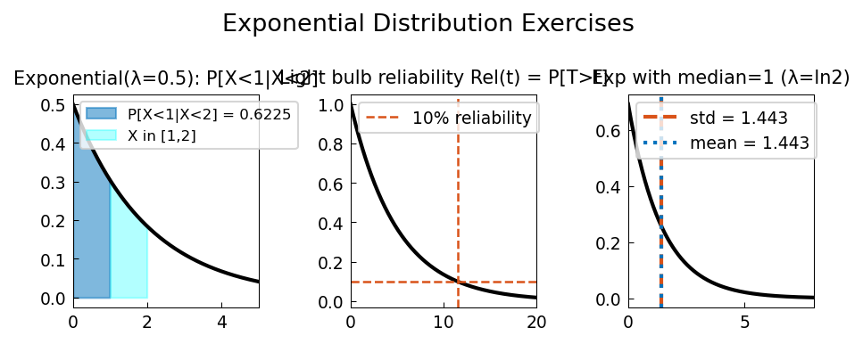

# Exponential Distribution Exercises

**Original:** [stats/ExponentialExercises](https://www.chebfun.org/examples/stats/ExponentialExercises.html)
**Author(s):** Nick Trefethen, September 2014

---

Memorylessness: P[X>a+b|X>a]=P[X>b]; conditional and unconditional probabilities.

## Code

```python
from examples.stats.exponential_exercises import run
run()
```

## Output


