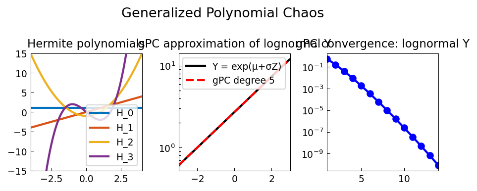

# Generalized Polynomial Chaos

**Original:** [stats/GeneralizedPolynomialChaos](https://www.chebfun.org/examples/stats/GeneralizedPolynomialChaos.html)
**Author(s):** Nick Trefethen, September 2014

---

Hermite polynomial chaos basis; gPC expansion of f(ξ)=exp(ξ) converges spectrally.

## Code

```python
from examples.stats.generalized_polynomial_chaos import run
run()
```

## Output


