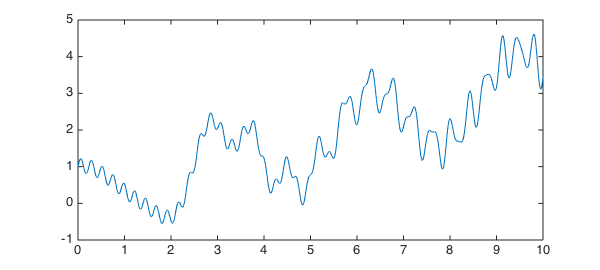
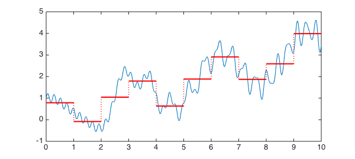
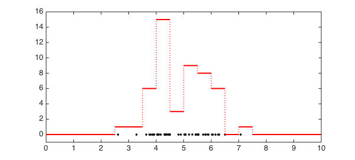

<!-- Generated by scripts/sync_chebfun_examples.py. -->
<!-- Source: https://www.chebfun.org/examples/stats/Histogram.html -->

<h1>Histogram from function or data</h1>
<h2>Nick Trefethen, May 2011 in <a href='../'>stats</a><a href='/examples/stats/Histogram.m'>download</a>&middot;<a href='//github.com/chebfun/examples/blob/master/stats/Histogram.m'>view on GitHub</a></h2>

<pre class="mcode-input">function Histogram</pre>

Suppose we have a chebfun, like this one:

<pre class="mcode-input">x = chebfun('x',[0,10]);
f = x/3 + cos(2*x) + .5*sin(x.^2) + .2*sin(27*x);
LW = 'linewidth';
plot(f,LW,1), hold on</pre>

and we have some bins defined by bin edges, like these:

<pre class="mcode-input">edges = 0:10;</pre>

and we want to "bin" $f$ into these bins.  Here is a <code>histogram</code> function that will do something along these lines.  In each bin, the value it stores is the total integral of $f$ in that interval.

<pre class="mcode-input">function h = hist(f,edges)
    nbins = length(edges)-1;
    data = zeros(nbins,1);
    fsum = cumsum(f);
    for k = 1:nbins
        a = edges(k); b = edges(k+1);
        data(k) = fsum(b)-fsum(a);
    end
    h = chebfun(num2cell(data),edges);
end</pre>

If we apply the function to our data, we get a histogram represented as a piecewise constant chebfun:

<pre class="mcode-input">h = hist(f,edges);
plot(h,'r',LW,2)</pre>

What if we wanted to start from data points rather than a function? Chebfun would allow us to do this with delta functions, like this:

<pre class="mcode-input">npts = 50; xpts = 5+randn(npts,1);
f2 = 0*x;
for j = 1:npts
    f2 = f2 + dirac(x-xpts(j));
end
hold off
plot(xpts,0*xpts,'.k','markersize',10)
edges = 0:.5:10;
h = hist(f2,edges);
hold on, plot(h,'r',LW,2)
ylim([-1,max(h)+1])</pre>

This is an extremely inefficient way to work with data, but it illustrates some of the ways in which chebfuns can be manipulated.

Perhaps an overload of Matlab's <code>hist</code> command should be included in Chebfun? Such an overload would certainly not use delta functions internally, and it would require some careful thinking about appropriate definitions.

<pre class="mcode-input">end</pre>

        

    

