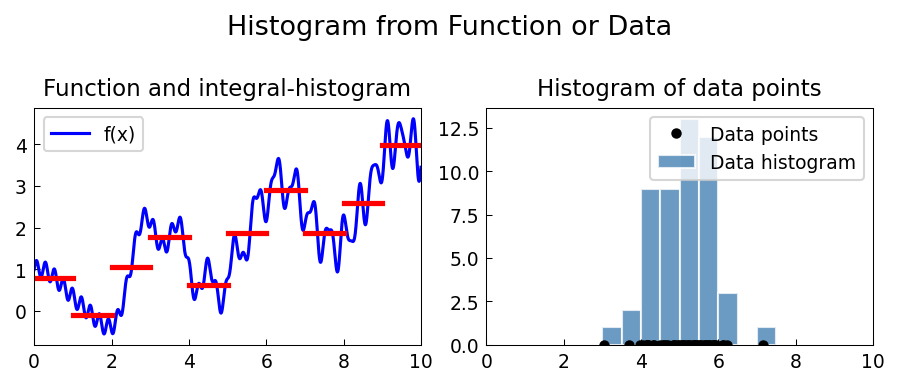

# Histogram

**Original:** [stats/Histogram](https://www.chebfun.org/examples/stats/Histogram.html)
**Author(s):** Nick Trefethen, May 2011

---

This example demonstrates how to construct histograms using Chebfun, both from
continuous functions and from discrete data points.

## Histogram from a function

Suppose we have a chebfun on $[0, 10]$:

$$f(x) = \frac{x}{3} + \cos(2x) + \tfrac{1}{2}\sin(x^2) + 0.2\sin(27x),$$

and a set of bin edges $0, 1, 2, \dots, 10$. We want to "bin" $f$ into these
intervals. The natural definition for a function histogram stores, in each bin,
the **total integral** of $f$ over that interval:

$$h_k = \int_{e_k}^{e_{k+1}} f(x)\,dx.$$

The cumulative sum (`cumsum`) of $f$ makes this easy: $h_k = F(e_{k+1}) - F(e_k)$
where $F = \int_0^x f$. The result is a piecewise-constant chebfun representing
the histogram.

## Histogram from data points

What if we start from discrete data rather than a function? We can represent
each data point $x_j$ as a Dirac delta function $\delta(x - x_j)$ and sum them
into a single chebfun:

$$f_2(x) = \sum_{j=1}^{n} \delta(x - x_j).$$

Applying the same binning procedure produces a histogram counting the number of
points per bin. This is an extremely inefficient way to work with data, but it
illustrates how chebfuns can represent and manipulate both continuous and
discrete objects within the same framework.

```python
from examples.stats.histogram import run
run()
```

## Output


