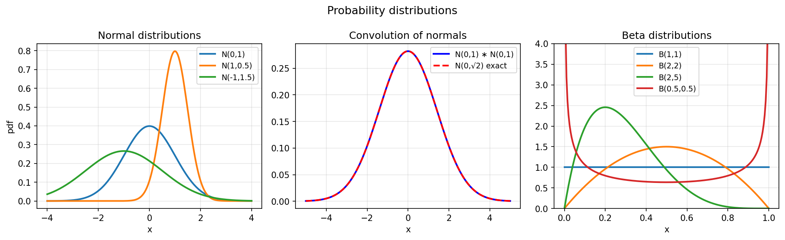
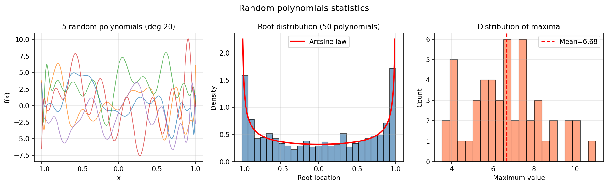

# Statistics and Probability Examples

Chebfunjax is well-suited for continuous probability distributions:
PDFs are just smooth functions, and expectations are integrals.

---

## Probability distributions and expectations

**Source:** `stats/Expectations.m`, `stats/BivariateNormalDistribution.m`,
`stats/ProbabilityConvolution.m` — various authors

```python
import jax.numpy as jnp
import numpy as np
import chebfunjax as cj

# Standard normal N(0,1)
phi = cj.chebfun(
    lambda x: jnp.exp(-x**2/2) / jnp.sqrt(2*jnp.pi),
    domain=[-5.0, 5.0]
)

# Total probability = 1
print(float(phi.sum()))           # ≈ 1.0

# Variance E[X²] = 1
x2_phi = cj.chebfun(
    lambda x: x**2 * jnp.exp(-x**2/2) / jnp.sqrt(2*jnp.pi),
    domain=[-5.0, 5.0]
)
print(float(x2_phi.sum()))        # ≈ 1.0
```



---

## Random polynomials

**Source:** `stats/RandomPolynomials.m`, `stats/RandomMaxima.m`

The roots of random polynomials (with i.i.d. Gaussian Chebyshev coefficients)
concentrate near `[-1,1]` and follow the arcsine distribution.

```python
import jax
import chebfunjax as cj

key = jax.random.PRNGKey(0)
coeffs = jax.random.normal(key, (21,))
f = cj.chebfun.from_coeffs(coeffs)
roots = f.roots()
# Distribution of real roots ≈ arcsine law: 1/(π√(1-x²))
```



---

## Other statistics examples

| MATLAB example | Description |
|---|---|
| `stats/BayesianGradebook.m` | Bayesian grade analysis |
| `stats/BetaExercise.m` | Beta distribution exercises |
| `stats/CentralLimitTheorem.m` | CLT via convolution |
| `stats/GeneralizedPolynomialChaos.m` | Generalized polynomial chaos |
| `stats/Histogram.m` | Histogram fitting |
| `stats/KellyCriterion.m` | Kelly criterion for betting |
| `stats/LeastSquares.m` | Least squares fitting |
| `stats/MercerKarhunenLoeve.m` | Mercer-Karhunen-Loève expansion |
| `stats/ResamplingRandomVariables.m` | Resampling random variables |
| `stats/Smoothies.m` | Smooth random functions |
| `stats/SmoothRandomWalk.m` | Smooth random walk |
| `stats/StochasticCollocationBurgers.m` | Stochastic collocation for Burgers |
| `stats/UniformExercises.m` | Uniform distribution exercises |
