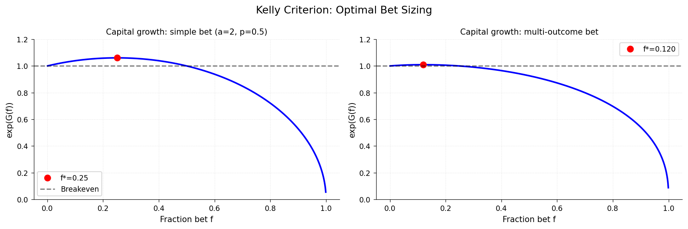

# Kelly Criterion

**Original:** [stats/KellyCriterion](https://www.chebfun.org/examples/stats/KellyCriterion.html)
**Author(s):** Nick Trefethen, September 2014

---

Optimal bet fraction f* maximizes G(f)=p·log(1+af)+(1-p)·log(1-f).

## Code

```python
from examples.stats.kelly_criterion import run
run()
```

## Output


