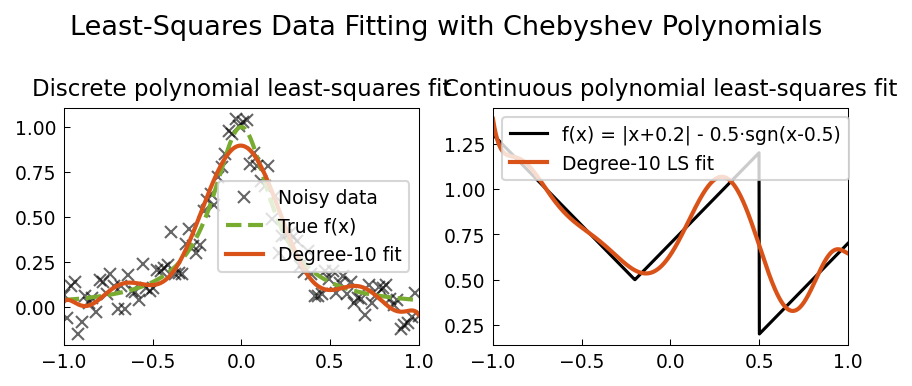

# Least Squares Fitting

**Original:** [stats/LeastSquares](https://www.chebfun.org/examples/stats/LeastSquares.html)
**Author(s):** Nick Trefethen, June 2012

---

Chebyshev polynomial least-squares fitting; best approximation vs interpolation.

## Code

```python
from examples.stats.least_squares import run
run()
```

## Output


