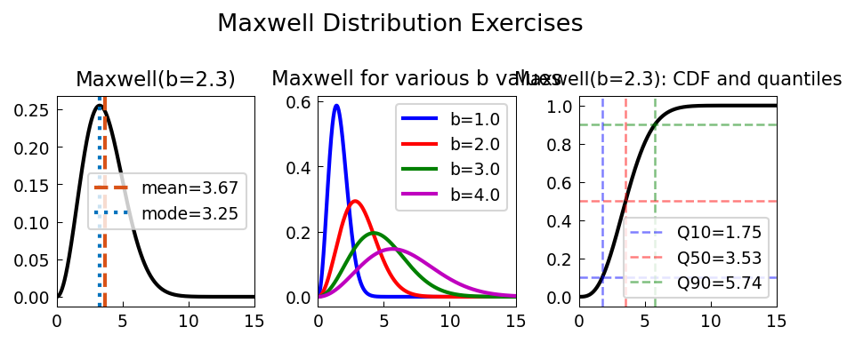

# Maxwell Distribution Exercises

**Original:** [stats/MaxwellExercises](https://www.chebfun.org/examples/stats/MaxwellExercises.html)
**Author(s):** Nick Trefethen, September 2014

---

Maxwell-Boltzmann speed distribution: mean √(8/π)σ, mode √2σ, variance (3-8/π)σ².

## Code

```python
from examples.stats.maxwell_exercises import run
run()
```

## Output


