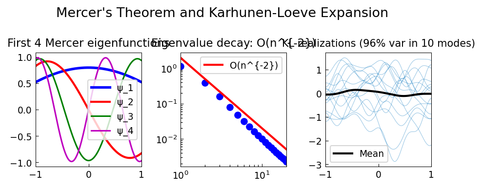

# Mercer-Karhunen-Loeve Expansion

**Original:** [stats/MercerKarhunenLoeve](https://www.chebfun.org/examples/stats/MercerKarhunenLoeve.html)
**Author(s):** Nick Trefethen, September 2014

---

Eigendecomposition of the exponential kernel K(s,t)=exp(-|s-t|/L); KL expansion.

## Code

```python
from examples.stats.mercer_karhunen_loeve import run
run()
```

## Output


