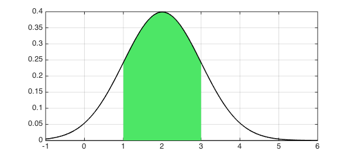
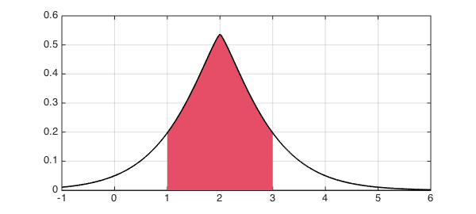

<!-- Generated by scripts/sync_chebfun_examples.py. -->
<!-- Source: https://www.chebfun.org/examples/stats/NormalExercises.html -->

<h1>Normal distribution: Exercises from a textbook</h1>
<h2>Jie Gao and Nick Trefethen, April 2013 in <a href='../'>stats</a><a href='/examples/stats/NormalExercises.m'>download</a>&middot;<a href='//github.com/chebfun/examples/blob/master/stats/NormalExercises.m'>view on GitHub</a></h2>

<h3 id="1-introduction">1. Introduction</h3>

Probability and statistics textbooks contain many exercise problems concerning various probability distributions.  In this Example we use Chebfun to solve a problem involving the normal distribution from the textbook [1].  Other similar Examples look at problems from the same book involving the exponential, beta, gamma, Rayleigh, and Maxwell distributions.

Like most textbooks, [1] emphasizes problems that can be solved on paper and don't need numerical tools such as Chebfun. As soon as one varies the problem a little, however, numerical solutions often become necessary. Thus first we solve the problem as written, and then we solve a variant.

<h3 id="2-problem-1d-page-124">2. Problem 1(d), page 124</h3>
<blockquote> If $X$ is normally distributed with mean $2$ and variance $1$, find $P[|X-2|&lt;1]$. </blockquote>

The probability density function (PDF) of the normal distribution can be defined like this:

<pre class="mcode-input">ff = @(x,mu,sigma) 1/(sigma*sqrt(2*pi))*exp(-0.5*((x-mu)/sigma).^2);</pre>

The domain is the entire real line, and this is a case where Chebfun has no difficulty working with that domain.  We can construct the chebfun like this:

<pre class="mcode-input">mu = 2;
sigma = 1;
f = chebfun(@(x) ff(x,mu,sigma), [-inf,inf]);</pre>

The cumulative density function (CDF) is the indefinite integral of $f$:

<pre class="mcode-input">fint = cumsum(f);</pre>

We can find the probability of $P[|X-2|&lt;1]$ like this:

<pre class="mcode-input">format long
p = fint(3)-fint(1)</pre>

<pre class="mcode-output">p =
   0.682689492136379
</pre>

Let's plot $f$ and the region $|X-2|&lt;1$:

<pre class="mcode-input">hold off, h = area(f{1,3});
set(h,'FaceColor',[0.3 0.9 0.4]), axis auto
LW = 'linewidth';
hold on, plot(f,'k',LW,1.6,'interval',[-1 6]), grid on</pre>

<h3 id="3-problem-1d-page-124-numerical-variant">3. Problem 1(d), page 124 -- numerical variant</h3>

Now let us do a similar computation, except replacing the quadratic term in the normal distribution by an absolute value with a $5/4$ power.

<pre class="mcode-input">ff = @(x,mu,sigma) exp(-abs((x-mu)/sigma).^(5/4));</pre>

The factor $1/\sqrt{2\pi\sigma}$ has been deleted because now we will have to normalize the distribution by hand. Here is the normalized chebfun:

<pre class="mcode-input">f = chebfun(@(x) ff(x,mu,sigma), [-inf,inf],'splitting','on');
f = f/sum(f);</pre>

We can compute the probability as before:

<pre class="mcode-input">fint = cumsum(f);
p = fint(3)-fint(1)</pre>

<pre class="mcode-output">p =
   0.718570707764524
</pre>

And here is a plot, with a new color for variety:

<pre class="mcode-input">hold off, h = area(f{1,3});
set(h,'FaceColor',[0.9 0.3 0.4]), axis auto
hold on, plot(f,'k',LW,1.6,'interval',[-1 6]), grid on</pre>

<h3 id="references">References</h3>
<ol>
<li>A. M. Mood, F. A. Graybill, and D. Boes, Introduction to the Theory of    Statistics, McGraw-Hill, 1974.</li>
</ol>

        

    

