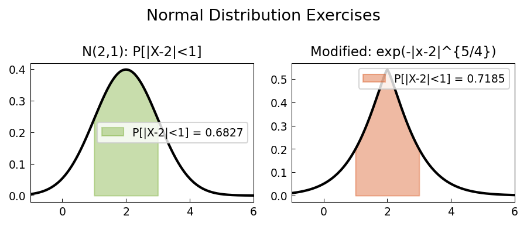

# Normal Distribution Exercises

**Original:** [stats/NormalExercises](https://www.chebfun.org/examples/stats/NormalExercises.html)
**Author(s):** Jie Gao and Nick Trefethen, April 2013

---

Probability and statistics textbooks contain many exercise problems concerning
various probability distributions. This example uses Chebfun to solve a problem
involving the normal distribution from the textbook [1]. As soon as one varies
the problem a little, numerical solutions often become necessary.

## Problem: $P[|X - 2| < 1]$ for a normal

If $X$ is normally distributed with mean $\mu = 2$ and variance $\sigma^2 = 1$,
find $P[|X - 2| < 1]$.

The PDF of the normal distribution is

$$f(x; \mu, \sigma) = \frac{1}{\sigma\sqrt{2\pi}} \exp\!\left(-\frac{(x-\mu)^2}{2\sigma^2}\right).$$

The CDF is obtained by indefinite integration, and the desired probability is

$$P[|X - 2| < 1] = F(3) - F(1) \approx 0.6827,$$

which is the familiar "one sigma" probability for the standard normal.

## Numerical variant

Replacing the quadratic exponent by an absolute value with a $5/4$ power gives
the modified density

$$\tilde{f}(x; \mu, \sigma) = c\,\exp\!\left(-\left|\frac{x - \mu}{\sigma}\right|^{5/4}\right),$$

where $c$ is a normalization constant (computed by numerical integration).
For this heavier-tailed distribution, $P[|X - 2| < 1] \approx 0.7186$ -- a
higher probability, reflecting more concentration near the mean.

## References

1. A. M. Mood, F. A. Graybill, and D. Boes, *Introduction to the Theory of
   Statistics*, McGraw-Hill, 1974.

```python
from examples.stats.normal_exercises import run
run()
```

