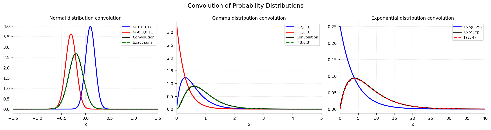

# Probability Convolution

**Original:** [stats/ProbabilityConvolution](https://www.chebfun.org/examples/stats/ProbabilityConvolution.html)
**Author(s):** Nick Trefethen, July 2012

---

Convolution of normal, gamma, and exponential PDFs using FFT-based convolution.

## Code

```python
from examples.stats.probability_convolution import run
run()
```

## Output


