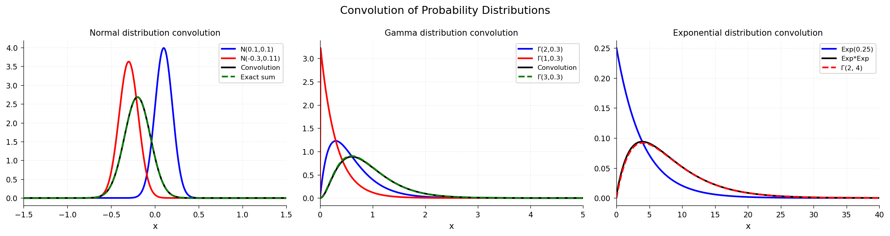
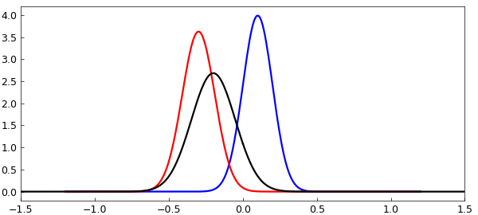
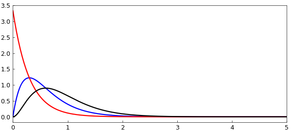
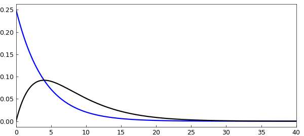
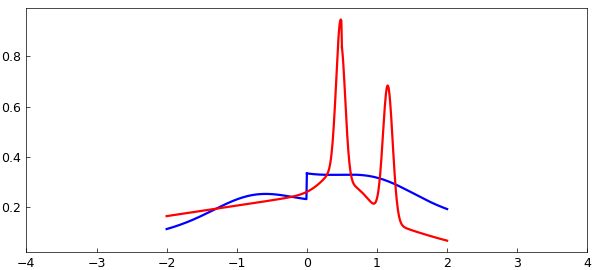
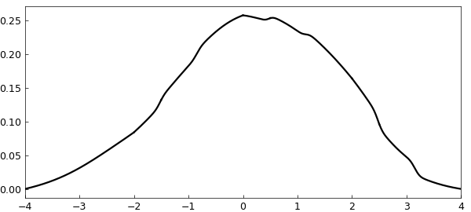

# Probability Convolution

**Original:** [stats/ProbabilityConvolution](https://www.chebfun.org/examples/stats/ProbabilityConvolution.html)
**Author(s):** Nick Hale and Alex Townsend, January 2014

---

It is well known that the probability distribution of the sum of two or more
independent random variables is the **convolution** of their individual
distributions:

$$h(x) = \int_{-\infty}^{\infty} f(t)\,g(x - t)\,dt.$$

Many standard distributions have simple closed-form convolutions. This example
verifies several of them and then computes convolutions for exotic distributions
where closed forms do not exist.

## Normal distribution

The normal distribution has PDF

$$f(x; \mu, \sigma) = \frac{1}{\sigma\sqrt{2\pi}} e^{-(x-\mu)^2 / 2\sigma^2}.$$

Convolving $N(\mu_1, \sigma_1^2)$ with $N(\mu_2, \sigma_2^2)$ yields
$N(\mu_1 + \mu_2,\, \sigma_1^2 + \sigma_2^2)$. Numerical convolution confirms
this to high precision.

## Gamma distribution

The gamma distribution has PDF

$$f(x; k, \theta) = \frac{x^{k-1} e^{-x/\theta}}{\theta^k\,\Gamma(k)}, \quad x \ge 0.$$

When two gamma distributions share the same scale parameter $\theta$, their
convolution satisfies

$$\mathrm{Gamma}(k_1, \theta) * \mathrm{Gamma}(k_2, \theta) = \mathrm{Gamma}(k_1 + k_2, \theta).$$

## Exponential distribution

The exponential distribution is a special case of the gamma with $k = 1$:

$$f(x; \lambda) = \lambda\,e^{-\lambda x}, \quad x \ge 0.$$

Convolving $\mathrm{Exp}(\lambda)$ with itself gives
$\mathrm{Gamma}(2, 1/\lambda)$, which is again verified numerically.

## Exotic distributions

For non-standard distributions, closed-form convolution results are unavailable,
and numerical computation is essential. As a demonstration, two discontinuous
distributions are constructed by summing a Heaviside function with several
Gaussians and normalizing. Their convolution gives the distribution of the sum
$z = x + y$, where $x$ and $y$ are drawn from these exotic distributions.

## References

1. [List of convolutions of probability distributions](http://en.wikipedia.org/wiki/List_of_convolutions_of_probability_distributions) (Wikipedia)
2. N. Hale and A. Townsend, Convolution of compactly supported functions.

```python
import numpy as np

# conv of two Gaussians: variances add
xs = np.linspace(-5, 5, 4001)
dx = xs[1] - xs[0]
g = lambda mu, s: np.exp(-0.5*((xs-mu)/s)**2) / (s*np.sqrt(2*np.pi))
full = np.convolve(g(-0.2, 0.3), g(0.2, 0.4)) * dx
N3 = full[(len(full)-len(xs))//2:][:len(xs)]
s3 = np.sqrt(np.trapezoid(xs**2 * N3, xs)
             - np.trapezoid(xs * N3, xs)**2)
print(f"combined std {s3:.4f} vs sqrt(.3^2+.4^2) = {np.hypot(.3,.4):.4f}")
```



## Figures (chebfun.org parity)










