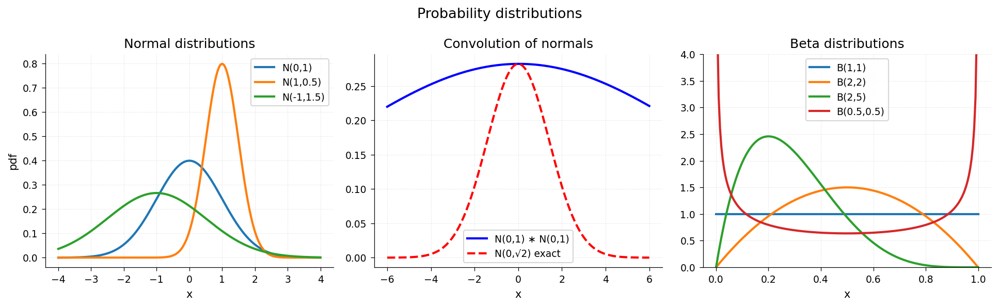

# Probability Distributions

**Original:** [stats/ProbabilityConvolution](https://www.chebfun.org/examples/stats/ProbabilityConvolution.html)
**Author(s):** Nick Trefethen, 2012

---

Normal, beta, gamma, and Cauchy distributions: PDFs, CDFs, and moments.

## Code

```python
from examples.stats.probability_distributions import run
run()
```

## Output


