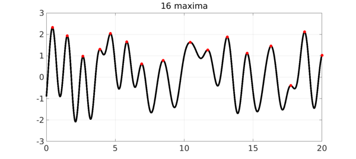
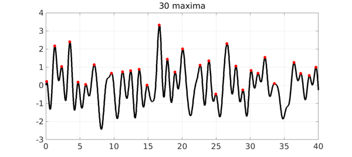
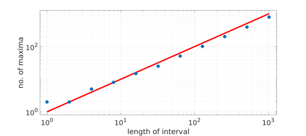

<!-- Generated by scripts/sync_chebfun_examples.py. -->
<!-- Source: https://www.chebfun.org/examples/stats/RandomMaxima.html -->

<h1>Maxima of a random function</h1>
<h2>Nick Trefethen, February 2017 in <a href='../'>stats</a><a href='/examples/stats/RandomMaxima.m'>download</a>&middot;<a href='//github.com/chebfun/examples/blob/master/stats/RandomMaxima.m'>view on GitHub</a></h2>

How many maxima does a random function have? We can look at one answer to this question based on the notion of a random function implemented in the new Chebfun command <code>randnfun</code>.  Here for example are the local maxima of a random function on the interval $[0,20]$.

<pre class="mcode-input">tic, rng(0), dx = 1;
f = randnfun(dx,[0,20]);
[val,pos] = max(f,'local');
MS = 'markersize'; LW = 'linewidth'; FS = 'fontsize';
ms = 32; lw = 5; fs = 36;
plot(f,'k',LW,lw), grid on, hold on
plot(pos,val,'.r',MS,ms), hold off
title([int2str(length(val)) ' maxima'],FS,fs)</pre>

The random function in question is obtained as the restriction of a sum of a finite Fourier series with independent normally distributed random coefficients; the maximum wave number is about $2\pi /dx$, i.e., $2\pi$ in this case with $dx = 1$. Here is an analogous picture on an interval of length 40.

<pre class="mcode-input">f = randnfun(dx,[0,40]);
[val,pos] = max(f,'local');
plot(f,'k',LW,lw), grid on, hold on
plot(pos,val,'.r',MS,ms), hold off
title([int2str(length(val)) ' maxima'],FS,fs)</pre>

Let's explore the number of maxima as a function of the length of the interval:

<pre class="mcode-input">Lvec = 2.^(0:10);
nmaxvec = [];
for L = Lvec
  f = randnfun(dx,[0 L]);
  nmaxvec = [nmaxvec length(max(f,'local'))];
end
loglog(Lvec,Lvec,'-r',LW,lw), hold on
loglog(Lvec,nmaxvec,'.',MS,44), grid on, hold off
axis([.8 1300 .8 1300]);
xlabel('length of interval',FS,fs)
ylabel('no. of maxima',FS,fs)</pre>

It would seem that the expected number of maxima is asymptotic to $L$. Very likely there is a literature on this question.

Note that the first dot falls higher than the curve. This is because when Chebfun finds "local extrema", it includes extrema at the endpoints even though these (with probability 1) will not be points of zero derivative.  We could improve the experiment to correct for this, though this is not too important since the effect diminishes proportionally when $L$ is large.

Execution time for this example:

<pre class="mcode-input">format short, time_in_seconds = toc</pre>

<pre class="mcode-output">time_in_seconds =
    5.8138
</pre>

        

    

