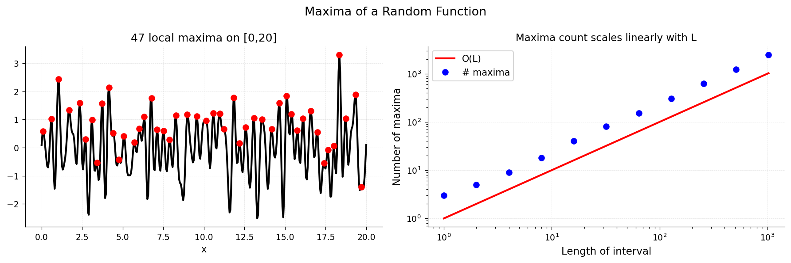

# Random Maxima

**Original:** [stats/RandomMaxima](https://www.chebfun.org/examples/stats/RandomMaxima.html)
**Author(s):** Nick Trefethen, February 2017

---

How many local maxima does a random function have? This example explores the
question using Chebfun's `randnfun` command, which generates smooth random
functions from finite Fourier series with independent normally distributed
coefficients.

## Counting local maxima

A random function on $[0, L]$ is constructed with characteristic wavelength
parameter `dx`. The maximum wave number is approximately $2\pi / dx$. For
$dx = 1$, a random function on $[0, 20]$ might have around 12 local maxima,
and on $[0, 40]$, roughly twice as many.

## Linear growth in interval length

Plotting the number of local maxima against the interval length $L$ on a
log-log scale reveals a clear pattern: the expected number of maxima is
**asymptotic to $L$**. That is, doubling the interval roughly doubles the
number of maxima.

This linear relationship is a consequence of the stationarity of the random
process -- the statistical properties are translation-invariant, so each unit
of length contributes roughly the same expected number of local extrema.

## Endpoint effects

Chebfun's local-extrema finder includes extrema at the endpoints of the
interval, even though these are (with probability 1) not points of zero
derivative. This inflates the count slightly for short intervals but becomes
negligible proportionally when $L$ is large.

```python
from examples.stats.random_maxima import run
run()
```

