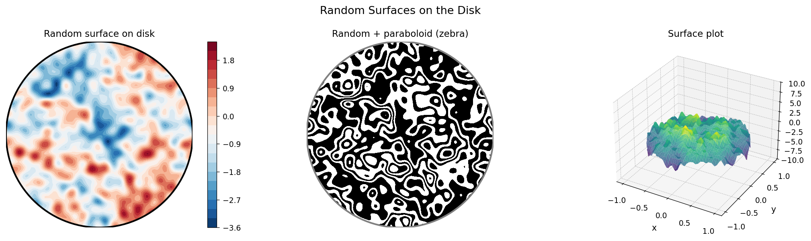

# Random Surfaces

**Original:** [stats/RandomSurf](https://www.chebfun.org/examples/stats/RandomSurf.html)
**Author(s):** Nick Trefethen, September 2014

---

Random surfaces on the unit disk via 2D Fourier series with random coefficients.

## Code

```python
from examples.stats.random_surf import run
run()
```

## Output


