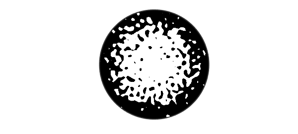
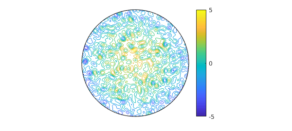
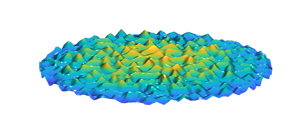

<!-- Generated by scripts/sync_chebfun_examples.py. -->
<!-- Source: https://www.chebfun.org/examples/stats/RandomSurf.html -->

<h1>Random surfaces</h1>
<h2>Nick Trefethen, May 2019 in <a href='../'>stats</a><a href='/examples/stats/RandomSurf.m'>download</a>&middot;<a href='//github.com/chebfun/examples/blob/master/stats/RandomSurf.m'>view on GitHub</a></h2>

Here is a smooth random function on the unit disk,

<pre class="mcode-input">rng(1), random = randnfundisk(0.1);</pre>

and here is a paraboloid on the same domain,

<pre class="mcode-input">paraboloid = diskfun(@(theta,r) 2-4*r.^2,'polar');</pre>

If we plot the sum of the two in zebra mode, we get an interesting picture:

<pre class="mcode-input">f = random + paraboloid;
plot(f,'zebra'), axis equal off</pre>

Of course zebra mode isn't the only way to plot a function.  Here is a contour plot:

<pre class="mcode-input">contour(f), colorbar, colormap('default'), axis off</pre>

And here is a surface plot:

<pre class="mcode-input">surf(f), zlim([-10 10])
camlight, camlight
view(0,60), axis off</pre>

The smooth random functions produced by <code>randnfundisk</code> are defined by finite Fourier series with random coefficients; see [7].  As discussed in Section 7 of that paper, random surfaces have been studied since Longuet-Higgins in 1957 [8], and application areas include oceanography [8], biology [10], cosmology [2,6,9], condensed matter physics [5], and the melting of the Arctic [4].  There is also interest among pure mathematicians [1] and other theoretical physicists [3]. Chebfun's smooth random functions are examples of Gaussian random fields [9].

Our choice in this example to show random functions on a disk is arbitrary.  Good times can also be had with <code>randnfun</code>, <code>randnfun2</code>, and <code>randnfunsphere</code>.

[1] R. J. Adler and J. E. Taylor, <em>Random Fields and Geometry,</em> Springer, 2009.

[2] J. M. Bardeen, J. R. Bond, N. Kaiser, and A. S. Szalay, The statistics of peaks of Gaussian random fields, Astrophys. J. 304 (1986), 15--61.

[3] E. Bogomolny and C. Schmit, Random wavefunctions and percolation, J. Phys. A 40 (2007), 14033--14043.

[4] B. Bowen, C. Strong, and K. M. Golden, Modeling the fractal geometry of Arctic melt pounds using the level sets of random surface, J. Fractal Geom. 5 (2018), 121--142.

[5] A. J. Bray and D. S. Dean, Statistics of critical points of Gaussian fields on large-dimensional spaces, Phys. Rev. Lett. 98 (2007), art. 150201.

[6] R. Easther, A. H. Guth, and A. Masoumi, Counting vacua in random landscapes, arXiv:1612.05224 (2016).

[7] S. Filip, A. Javeed, and L. N. Trefethen, Smooth random functions, random ODEs, and Gaussian processes, SIAM Rev. 61 (2019), 185--205.

[8] M. S. Longuet-Higgins, The statistical analysis of a random, moving surface, Phil. Trans. Roy. Soc. Lond. A 429 (1957), 321--387.

[9] J. Peacock, <em>Cosmological Physics</em>, Cambridge, 1999.

[10] A. Swishchuk and J. Wu, <em>Evolution of Biological Systems in Random Media</em>, Springer, 2013.

        

    

