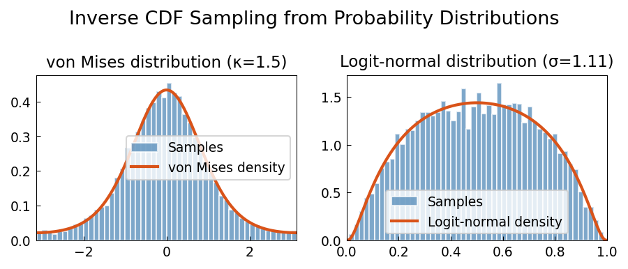

# Resampling Random Variables

**Original:** [stats/ResamplingRandomVariables](https://www.chebfun.org/examples/stats/ResamplingRandomVariables.html)
**Author(s):** Toby Driscoll, December 2011

---

A common problem in applications of random variables is drawing samples from a
given distribution. Standard libraries generate uniformly or normally distributed
pseudorandom numbers, and these must be transformed to simulate other target
distributions. The key steps are **integration** and **function inversion** --
both operations that Chebfun handles with great accuracy.

## The inverse CDF method

If $F$ is the CDF of a target distribution and $U \sim \mathrm{Uniform}(0,1)$,
then $X = F^{-1}(U)$ has the target distribution. The challenge is computing
$F^{-1}$ efficiently and accurately.

## Von Mises distribution

The von Mises distribution is a periodic analog of the normal distribution,
with density

$$f(\theta) \propto \exp(\kappa \cos\theta), \quad \theta \in [-\pi, \pi],$$

where $\kappa > 0$ controls concentration. While the density is easily defined,
analytical work with the von Mises distribution is otherwise difficult.

The procedure is:

1. Construct a chebfun for the normalized density.
2. Integrate to get the CDF.
3. Invert the CDF using `inv` to obtain $F^{-1}$ as a chebfun.
4. Apply $F^{-1}$ to uniform random samples.

The resulting histogram of samples matches the original density closely.

## Logit-normal distribution

The logit-normal distribution is more troublesome: its density vanishes at both
endpoints of $[0,1]$, so $F'(0) = F'(1) = 0$ and $F^{-1}$ has infinite slope
at the boundaries. A naive inversion will fail.

Three tricks address this:

1. **Symmetry:** restrict attention to $x > 1/2$ and reflect.
2. **Splitting mode:** help Chebfun cope with endpoint singularities.
3. **Domain truncation:** work on $[0, 1 - 10^{-3}]$ instead of $[0, 1]$.

The probability mass lost by truncation is negligible (less than $10^{-9}$).
Resampling then proceeds as before, with uniform values below 1/2 reflected
into $[1/2, 1]$, mapped through the inverse CDF, and reflected back.

```python
from examples.stats.resampling_random_variables import run
run()
```

## Output


