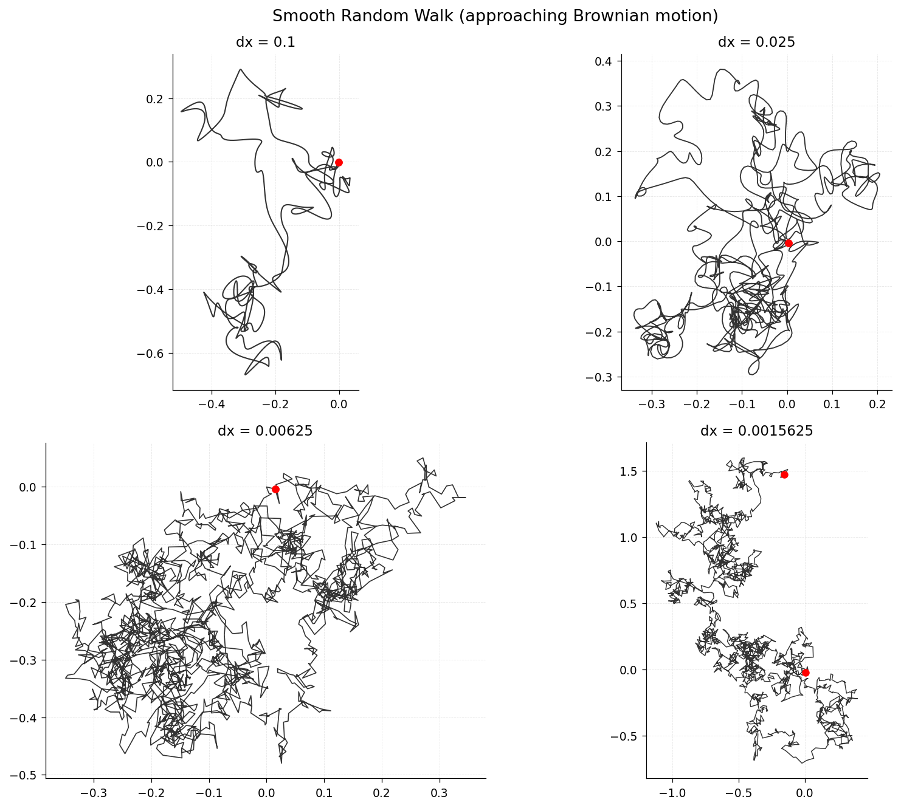

# Smooth Random Walk

**Original:** [stats/SmoothRandomWalk](https://www.chebfun.org/examples/stats/SmoothRandomWalk.html)
**Author(s):** Nick Trefethen, July 2012

---

Random walk via cumulative integration of a random Fourier series.

## Code

```python
from examples.stats.smooth_random_walk import run
run()
```

## Output


