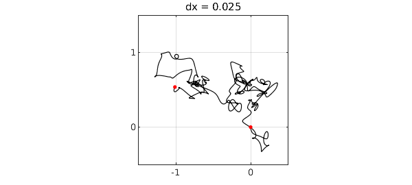
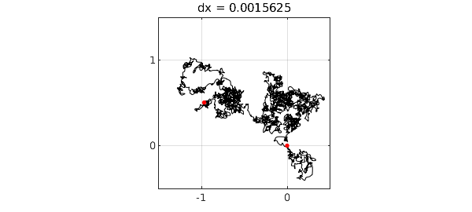

<!-- Generated by scripts/sync_chebfun_examples.py. -->
<!-- Source: https://www.chebfun.org/examples/stats/SmoothRandomWalk.html -->

<h1>Smooth random walk</h1>
<h2>Nick Trefethen, February 2017 in <a href='../'>stats</a><a href='/examples/stats/SmoothRandomWalk.m'>download</a>&middot;<a href='//github.com/chebfun/examples/blob/master/stats/SmoothRandomWalk.m'>view on GitHub</a></h2>

By integrating coin flips in one or more dimensions, we get a random walk, which becomes Brownian motion in the limit of infinitely many infinitely small steps. Chebfun's <code>randnfun</code> command enables us to explore a smooth continuous analogue of this process.

Let's work in 2D, using a complex variable for convenience. Here we plot the indefinite integral of a complex random function scaled by $(dx)^{-1/2}$.  Red dots mark the initial and end points.

<pre class="mcode-input">LW = 'linewidth'; MS = 'markersize';
ms = 12;
dx = 0.1;
rng(1), f = randnfun(dx,'big','complex');
g = cumsum(f);
plot(g,'k',LW,1), grid on, hold on
plot(g([-1 1]),'.r',MS,ms), hold off
axis([-1.5 .5 -.5 1.5]), axis square
title(['dx = ' num2str(dx)])
set(gca,'xtick',-2:2,'ytick',-2:2)</pre>

We divide the characteristic length defining the random function by 4 three times. The limit of Brownian motion is being approached. For details, see [1].

<pre class="mcode-input">for k = 1:3
  dx = dx/4;
  rng(1), f = randnfun(dx,'big','complex');
  g = cumsum(f);
  plot(g,'k',LW,1-.15*k), grid on, hold on
  plot(g([-1 1]),'.r',MS,ms), hold off
  axis([-1.5 .5 -.5 1.5]), axis square
  title(['dx = ' num2str(dx)])
  set(gca,'xtick',-2:2,'ytick',-2:2), snapnow
end</pre>

[1] S. Filip, A. Javeed, and L. N. Trefethen, Smooth random functions, random ODEs, and Gaussian processes, <em>SIAM Rev.</em> 61 (2019), 185-205.

        

    

    

        
&copy; Copyright 2025 the University of Oxford and the Chebfun Developers.

        
    

    
    
    
    
    
    
    
    
  </body>

