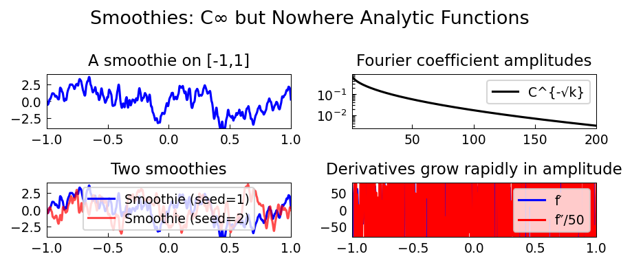

# Smoothies

**Original:** [stats/Smoothies](https://www.chebfun.org/examples/stats/Smoothies.html)
**Author(s):** Nick Trefethen, February 2020

---

Since Weierstrass in the 19th century, we have known that there are functions
that are continuous yet nowhere differentiable. Such functions arise from
lacunary or random Fourier series. A classic example is a Brownian path, defined
by a Fourier series with random coefficients of magnitudes decreasing
inverse-linearly.

## Nowhere analytic but $C^\infty$

At the other end of the smoothness spectrum: can we construct functions that are
$C^\infty$ (infinitely differentiable) but **nowhere analytic**? The standard
example of nonanalyticity at a single point is $f(x) = \exp(-1/x^2)$, which has
all derivatives zero at $x = 0$, so its Taylor series is $0 + 0x + 0x^2 + \cdots$
-- obviously not converging to $f$. But can we upgrade this to a function whose
Taylor series fails to converge at _every_ point in $[-1,1]$?

## Construction via random Fourier series

Random Fourier series give an elegant solution. Chebfun implements this through
the `smoothie` command. A smoothie is constructed from a random Fourier series
on an interval longer than $[-1,1]$ (to ensure translation-invariant statistics),
then restricted to $[-1,1]$.

The key is the decay rate of the Fourier coefficients: they decrease
**root-exponentially**, at a rate $C^{-\sqrt{n}}$ with $C > 1$. This is

- faster than any polynomial $n^{-k}$ (so the function is $C^\infty$), but
- slower than any exponential $e^{-\alpha n}$ (so the function is nowhere
  analytic).

## Chebyshev coefficients

The Chebyshev coefficients of a smoothie show random amplitudes with
root-exponential decay. This intermediate rate -- between algebraic and
geometric -- is the hallmark of functions that are smooth but not analytic.

## Derivatives and Taylor series

The first and second derivatives of a smoothie are themselves smooth functions,
but with rapidly growing amplitudes and visible structure on smaller and smaller
scales. At any point $x \in [-1,1]$, the Taylor series of $f$ is well defined,
but the coefficients grow too fast for a positive radius of convergence.

## Variants

- **Periodic smoothies** (`'trig'` flag): constructed directly as periodic
  Fourier series.
- **Complex smoothies** (`'complex'` flag): trace intricate curves in the
  complex plane.

## References

1. G. G. Bilodeau, The origin and early development of non-analytic infinitely
   differentiable functions, *Arch. Hist. Exact Sci.* 27 (1982), 115--135.
2. S. Filip, A. Javeed, and L. N. Trefethen, Smooth random functions, random
   ODEs, and Gaussian processes, *SIAM Rev.* 61 (2019), 185--205.
3. J.-P. Kahane, *Some Random Series of Functions*, 2nd ed., Cambridge, 1985.

```python
from examples.stats.smoothies import run
run()
```

## Output


