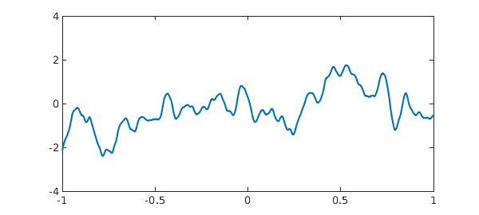
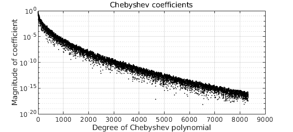
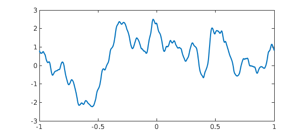
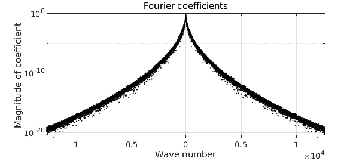
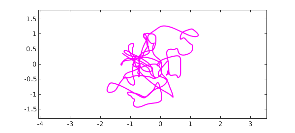
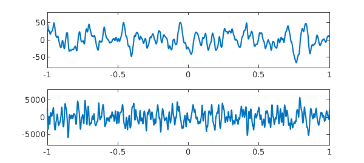

<!-- Generated by scripts/sync_chebfun_examples.py. -->
<!-- Source: https://www.chebfun.org/examples/stats/Smoothies.html -->

<h1>Smoothies: nowhere analytic functions</h1>
<h2>Nick Trefethen, February 2020 in <a href='../'>stats</a><a href='/examples/stats/Smoothies.m'>download</a>&middot;<a href='//github.com/chebfun/examples/blob/master/stats/Smoothies.m'>view on GitHub</a></h2>

Since Weierstrass in the 19th century, we have known that there are functions that are continuous and yet nowhere differentiable. Such functions are associated with Fourier or Chebyshev series that are lacunary or random.  A beautiful example is a Brownian path, which can be defined by a Fourier series with random coefficients of magnitudes decreasing inverse-linearly [1,2].

At the other end of the smoothness spectrum, in a common room discussion in Oxford we found ourselves wondering, what about functions that are $C^\infty$, i.e. infinitely differentiable, but nowhere analytic? It is well known how to cook up a $C^\infty$ function that is nonanalytic at a single point.  The standard example is $f(x) = \exp(-1/x^2)$ for $x\in [-1,1]$, which has zero derivatives of all orders at $x=0$ and thus a Taylor series $0 + 0x + 0x^2 + \cdots,$ but with the Taylor series obviously not converging to $f$.  Can we upgrade this to a function which has Taylor series everywhere in $[-1,1]$, yet with none of them converging to the right limit?

Random Fourier series again give an elegant solution, and in Chebfun, with apologies to the fruit beverage industry, this has been implemented by the new command <code>smoothie</code>. Here is a smoothie on the default interval $[-1,1]$:

<pre class="mcode-input">rng(1)
f = smoothie;
plot(f)
ylim([-4 4])</pre>

To see the idea, we can look at the magnitudes of the Chebyshev coefficients:

<pre class="mcode-input">plotcoeffs(f,'color','k')</pre>

These are random numbers of amplitudes decreasing faster than the reciprocal of any polynomial, but slower than exponentially.  This is enough to guarantee that (with probability 1) $f$ is $C^\infty$ but nowhere analytic. To be a little more precise, the construction of a smoothie closely follows that of a smooth random function, implemented in the command <code>randnfun</code>.  To ensure that the statistical properties are translation-invariant rather than changing as $x$ approaches $\pm 1$, the function is actually constructed via a random Fourier rather than Chebyshev series (hence periodic) on a longer interval than $[-1,1]$, which is then restricted to $[-1,1]$. The Fourier coefficients decrease root-exponentially in amplitude, that is, at a rate $C^{-\sqrt n}$ with $C&gt;1$.

To get a periodic smoothie, one can use the <code>'trig'</code> flag:

<pre class="mcode-input">ftrig = smoothie('trig');
plot(ftrig), snapnow
plotcoeffs(ftrig,'color','k')</pre>

For all the details, take a look at the (quite simple) code <code>smoothie.m</code>. Another option is a complex smoothie,

<pre class="mcode-input">fcomplex = smoothie('complex');
plot(fcomplex,'m'), ylim([-1.8 1.8]), axis equal</pre>

What do the Taylor series of these functions look like?  To give the idea, we plot the first and second derivatives of the original function $f$ at the beginning of this example:

<pre class="mcode-input">subplot(2,1,1), plot(diff(f)), ylim([-80 80])
subplot(2,1,2), plot(diff(f,2)), ylim([-8000 8000])</pre>

These are smooth functions, but they are rapidly getting bigger in amplitude as well as having visible structure on smaller and smaller space scales.  At any point $x\in [-1,1]$, the Taylor series of $f$ will be well defined, but with coefficients growing too fast for a positive radius of convergence.

Here are quite a few references.  For history, a good starting point is the paper by Bilodeau.

[1] G. G. Bilodeau, The origin and early development of non-analytic infinitely differentiable functions, <em>Arch. Hist. Exact Sci.</em> 27 (1982), 115-135.

[2] R. B. Darst, Most infinitely differentiable functions are nowhere analytic, <em>Canadian Math. Bull.</em> 16 (1973), 597-598.

[3] J. Fabius, A probabilistic example of a nowhere analytic $C^\infty$-function, <em>Z. Wahrscheinlichkeitstheorie verw. Geb.</em> 5 (1966), 173-174.

[4] S. Filip, A. Javeed, and L. N. Trefethen, Smooth random functions, random ODEs, and Gaussian processes, <em>SIAM Rev.</em> 61 (2019), 185-205.

[5] J.-P. Kahane, <em>Some Random Series of Functions</em>, 2nd ed., Cambridge, 1985.

[6] B. Kharazishvili, <em>Strange Functions in Real Analysis</em>, CRC Press, 2017.

[7] K. G. Merryfield, A nowhere analytic $C^\infty$ function, <em>Missouri J. Math. Sci.</em>, 4 (1992), 132-138.

[8] D. Morgenstern, Unendlich oft differenzierbare nichtanalytische Funktionen, <em>Math. Nachr.</em> 12 (1954), 74

[9] T. Park, $C^\infty$ but nowhere analytic functions, dissertation, MSc in Mathematical Sciences, Oxford, 2021.

[10] W. Rudin, <em>Real and Complex Analysis</em>, McGraw-Hill, 1974, Ex 13 on p. 418.

[11] H. Salzmann and  K. Zeller, Singularit&auml;ten unendlich oft differenzierbarer Funktionen, <em>Math. Z.</em> 62 (1955), 354-367.

[12] P. Walczak, A proof of some theorem on the $C^\infty$-functions of one variable which are not analytic, <em>Demonstratio Math.</em> 4 (1972), 209-214.

        

    

    

        
&copy; Copyright 2025 the University of Oxford and the Chebfun Developers.

        
    

    
    
    
    
    
    
    
    
  </body>
</html>

