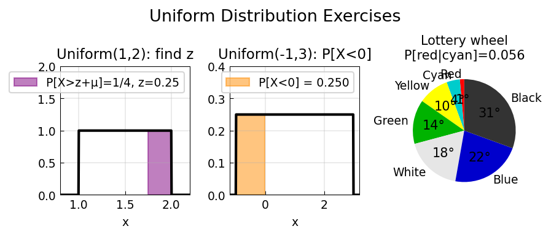

# Uniform Distribution Exercises

**Original:** [stats/UniformExercises](https://www.chebfun.org/examples/stats/UniformExercises.html)
**Author(s):** Jie Gao, July 2013

---

This example uses Chebfun to solve problems involving the uniform distribution
from the textbook [1]. As with other distribution exercises, the original
problems are solvable by hand, but numerical tools become essential for
variations.

## Problem 1: finding a quantile

If $X$ is uniformly distributed over $(1,2)$, find $z$ such that
$P[X > z + \mu_X] = 1/4$.

The PDF is $f(x) = 1$ on $[1, 2]$ and the mean is $\mu_X = 3/2$.
Setting $a = z + \mu_X$ and solving $1 - F(a) = 1/4$ gives $a = 7/4$,
so $z = 1/4$.

## Problem 2: recovering parameters from moments

Suppose $X$ has a uniform distribution with mean 1 and variance $4/3$.
What is $P[X < 0]$?

For a uniform distribution on $(a, b)$, the mean is $(a+b)/2$ and the variance
is $(b-a)^2/12$. We must solve

$$\frac{a+b}{2} = 1, \qquad \frac{(b-a)^2}{12} = \frac{4}{3}.$$

This gives $a = -1$ and $b = 3$, so $P[X < 0] = F(0) = 1/4$.

Several approaches work:

- **Chebfun2:** find common roots of the two equations in $(a, b)$.
- **Elimination:** express $b = 2 - a$ from the mean equation and solve the
  remaining variance equation with `roots`.

Both methods confirm $a = -1$, $b = 3$.

## Application: lottery wheel

A lottery wheel is partitioned into colored sectors with angular widths: red
(5 deg), cyan (15 deg), yellow (35 deg), green (50 deg), white (65 deg), blue
(80 deg), black (110 deg). The arrow position $X$ is uniformly distributed over
$[0^\circ, 360^\circ]$.

**Q1:** The probability of landing on red or cyan is
$(5 + 15)/360 \approx 0.0556$.

**Q2:** Given that the arrow does not point to blue, what is the probability it
points to neither black nor yellow? By Bayes' theorem:

$$P[\text{not yellow, not black} \mid \text{not blue}]
= \frac{360 - 35 - 110 - 80}{360 - 80}
= \frac{135}{280} \approx 0.482.$$

## References

1. A. M. Mood, F. A. Graybill, and D. Boes, *Introduction to the Theory of
   Statistics*, McGraw-Hill, 1974.

```python
from examples.stats.uniform_exercises import run
run()
```

## Output


