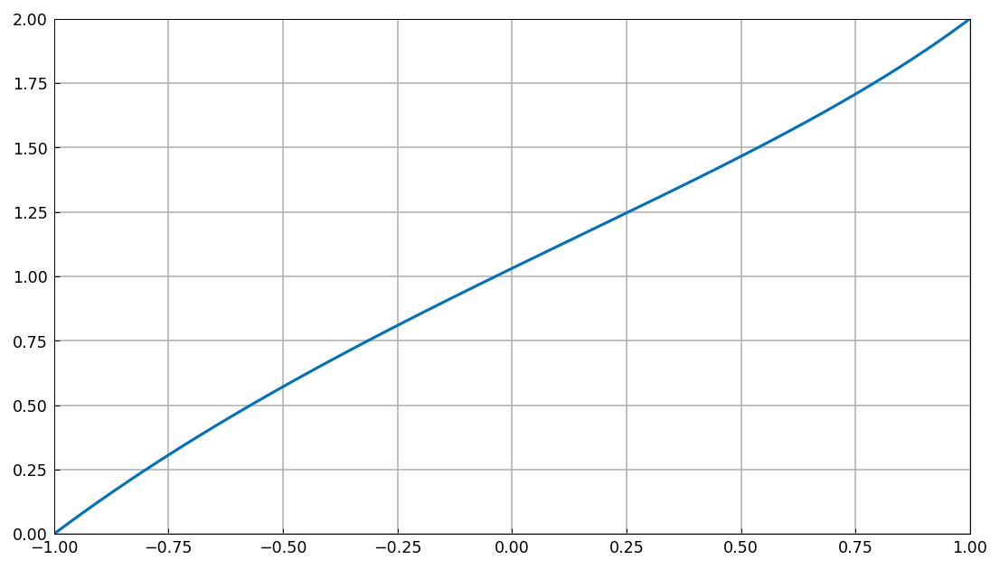
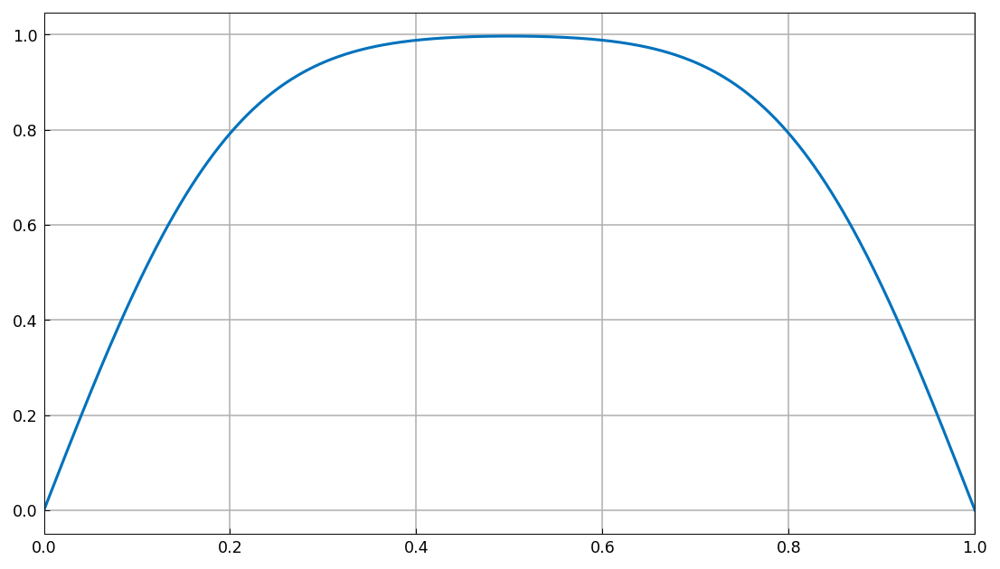
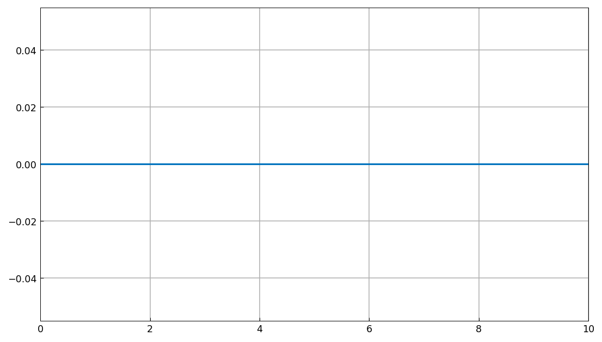
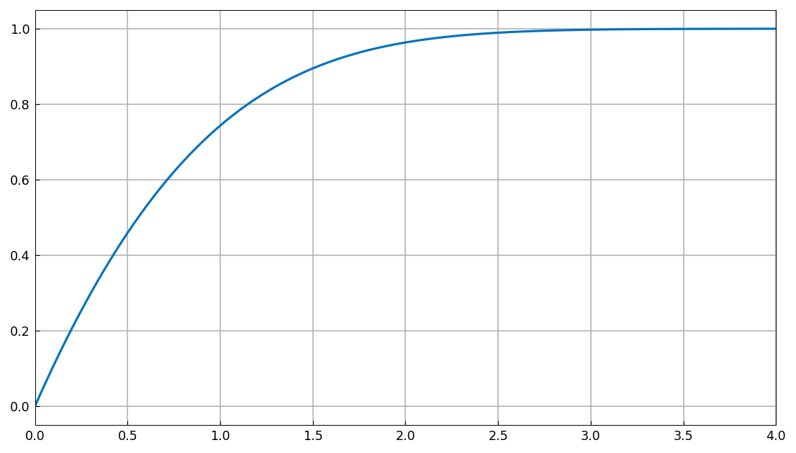
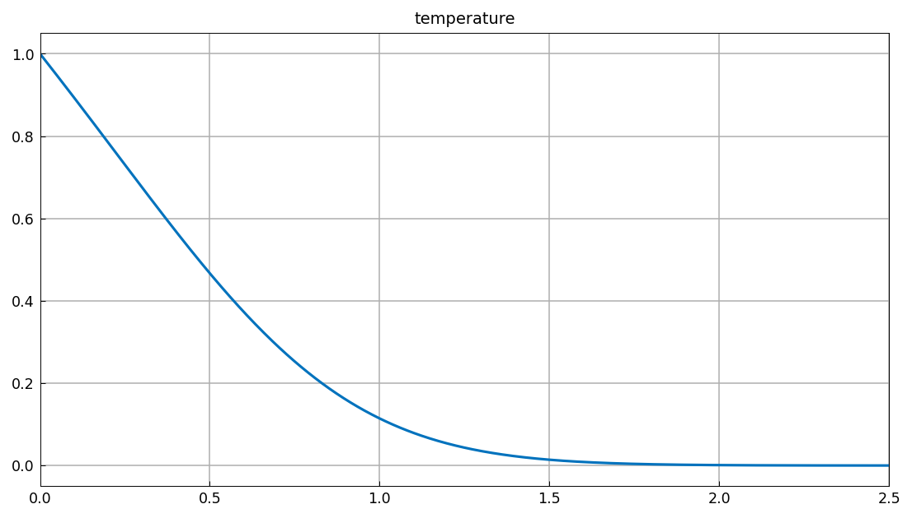
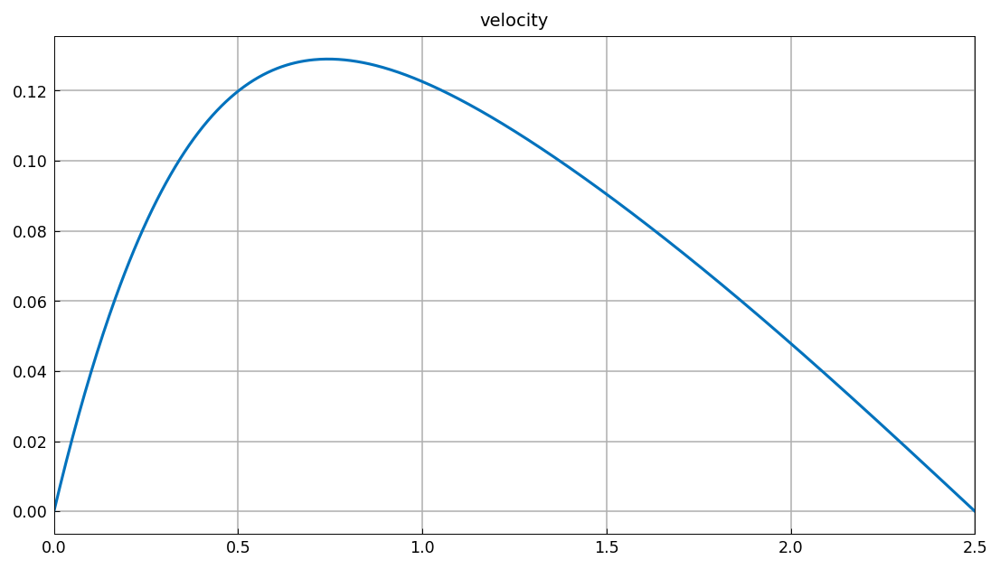

# Problems from Binous, Shaikh and Bellagi

[Original MATLAB Chebfun example](https://www.chebfun.org/examples/temp/BinousShaikhBellagi.html)

(Chebfun example temp/BinousShaikhBellagi.m — Nick Trefethen,
September 2014)

Binous, Shaikh, and Bellagi [1] explore transport-phenomena problems
solvable by Chebyshev spectral methods. Here several are solved with
chebop.

## 1. Split boundary value problem

$$ uu' - u'' = 1, \quad u(-1) = 0,~ u(1) = 2. $$



The values at $x = 0$ and $x = 1/\sqrt 2$ agree with BSB Table 1
(published `1.030986977102136   1.663419631612752` — ours matches to
15 digits):

```text
ans =
   1.030986977102138   1.663419631612755
```

## 2. Diffusion problem

$u_t = u_{yy}$ with homogeneous Dirichlet conditions, evaluated at
$t = 0.0126$ via the operator exponential `expm`:



The value at $y = 0.5$ (published `0.996731280153050`, matched to 10
digits):

```text
ans =
   0.996731280144869
```

## 4. Unsteady convection-diffusion problem

The published attempt (which the original notes "doesn't work; more
thought needed") reproduced as-is:



## 5. Falkner-Skan equation

$$ f''' + ff'' + (\pi/4)(1-(f')^2) = 0,\quad f(0)=f'(0)=0,~
f'(\infty)=1, $$

solved on $[0,4]$; the derivative:



## 7. Convection past an isothermal plate

The coupled system
$F''' + 3FF' - 2(F')^2 + T = 0$, $T'' + 30FT' = 0$ with five
boundary conditions on $[0, 2.5]$. (From the zero initial guess our
Newton lands on a spurious flat-temperature branch; seeding a
decaying profile recovers the published solution.) The temperature
and velocity profiles match the published figures — $T(1) = 0.114$,
velocity peak $\approx 0.12$ near $y = 0.72$:




## Reference

1. H. Binous, A. A. Shaikh, and A. Bellagi, "Chebyshev orthogonal
   collocation technique to solve transport phenomena problems with
   Matlab and Mathematica", _Computer Applications in Engineering
   Education_, 2014, pp. 1-10.

---

*Replica script: [`examples/temp/binousshaikhbellagi_replica.py`](https://github.com/ma-gilles/chebfunjax/blob/main/examples/temp/binousshaikhbellagi_replica.py).
Original example copyright by The University of Oxford and The Chebfun
Developers.*
