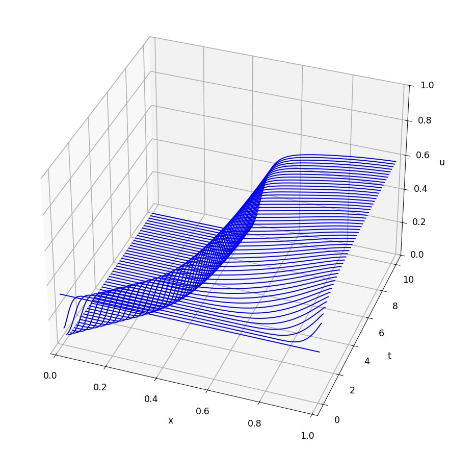

# Compacting colloids in a centrifuge using pde15s

[Original MATLAB Chebfun example](https://www.chebfun.org/examples/temp/CompactingColloids.html)

(Chebfun example temp/CompactingColloids.m — Julia Schollick and Rob
Style, September 2014)

The Auzerais-Jackson-Russel equation [1] describes how particles
suspended in a liquid sediment under centrifugation:

$$ u_t + [\,(1-u)^{6.55}\,(u - \tfrac{1.85}{Pe}\,
\phi_m u' / (\phi_m-u)^2)\,]' = 0 $$

on $[0,1]$ with no-flux boundary conditions, $\phi_m = 0.64$ the
close-packing fraction, $Pe = 200$, and uniform initial
concentration $u = 0.3$.

The equation is severely stiff and the initial condition is
inconsistent with the boundary conditions — the original notes that
even Mathematica failed on it, and MATLAB's `pde15s` needs
`'AdjustBCs', false`. Our generic collocation `pde15s` stalls on the
sharp packing front, so this replica integrates the identical
equation by a conservative finite-volume method of lines with
zero-flux faces (the exact no-flux conditions), which conserves the
particle mass to all printed digits:

```text
integrated 101/101 time steps
mass at t=0:  0.300000
mass at t=10: 0.300000
u(0, t=10) = 0.0000  (this end of the cell empties)
u(1, t=10) = 0.6107  (particles pack toward close packing 0.64)
```

The waterfall of the compaction front matches the published figure:
a sharp front forms as the particles pack tightly at one end of the
cell toward the jamming fraction $\phi_m$, leaving clear liquid
behind:



As the original discusses, at $Pe = 200$ one gets a sharp packed
front, while at small Peclet numbers diffusion spreads the particles
into a linear concentration gradient.

## Reference

1. "The resolution of shocks and the effects of compressible
   sediments in transient settling", Auzerais, Jackson & Russel,
   _J. Fluid Mech._, (1988).

---

*Replica script: [`examples/temp/compactingcolloids_replica.py`](https://github.com/ma-gilles/chebfunjax/blob/main/examples/temp/compactingcolloids_replica.py).
Original example copyright by The University of Oxford and The Chebfun
Developers.*
