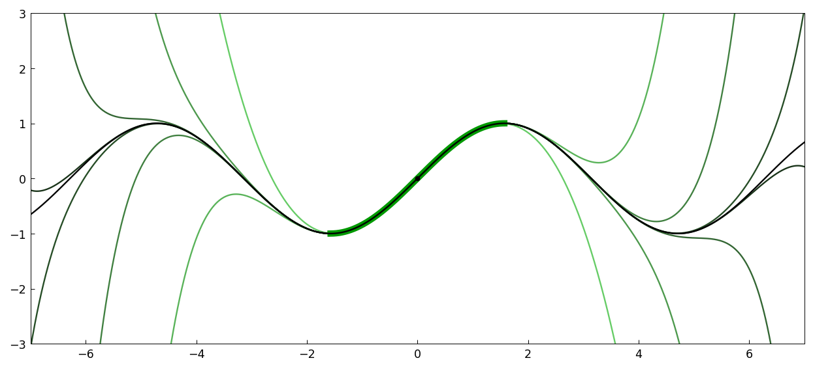
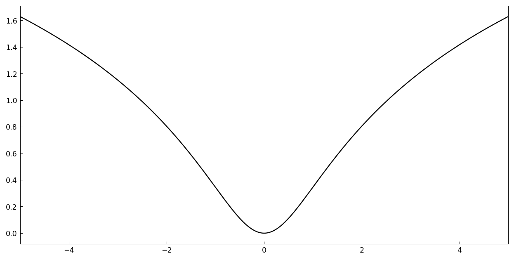
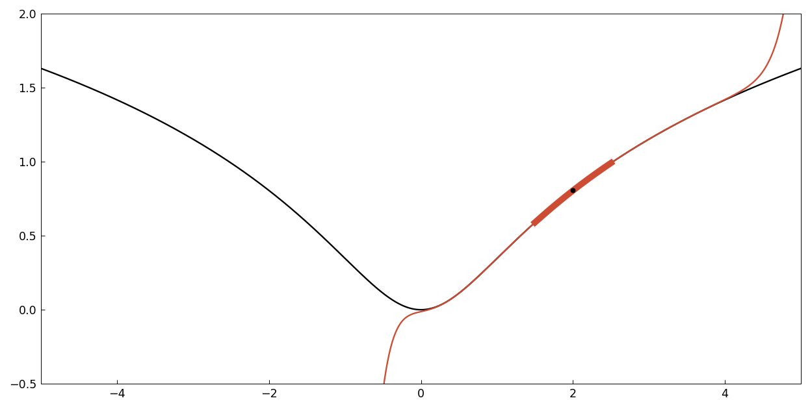
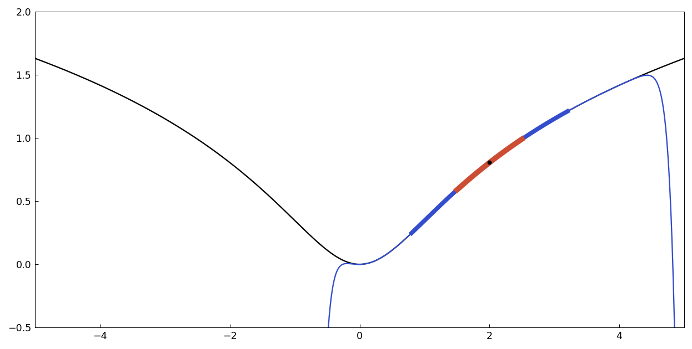
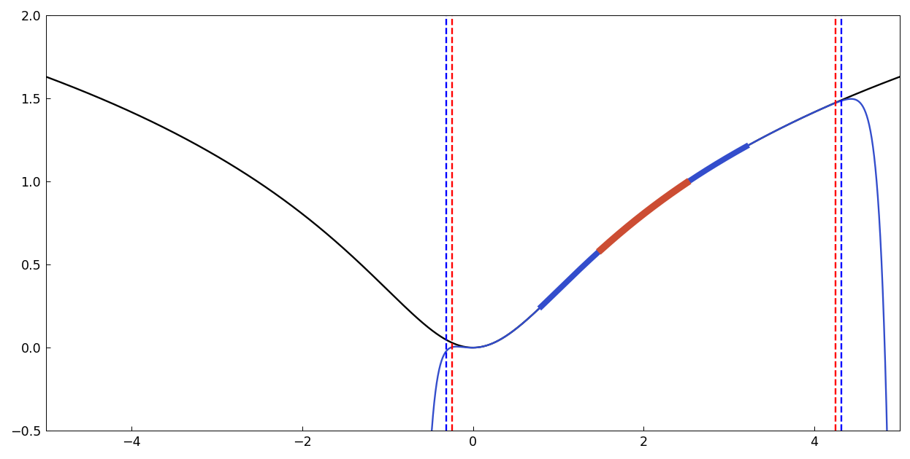
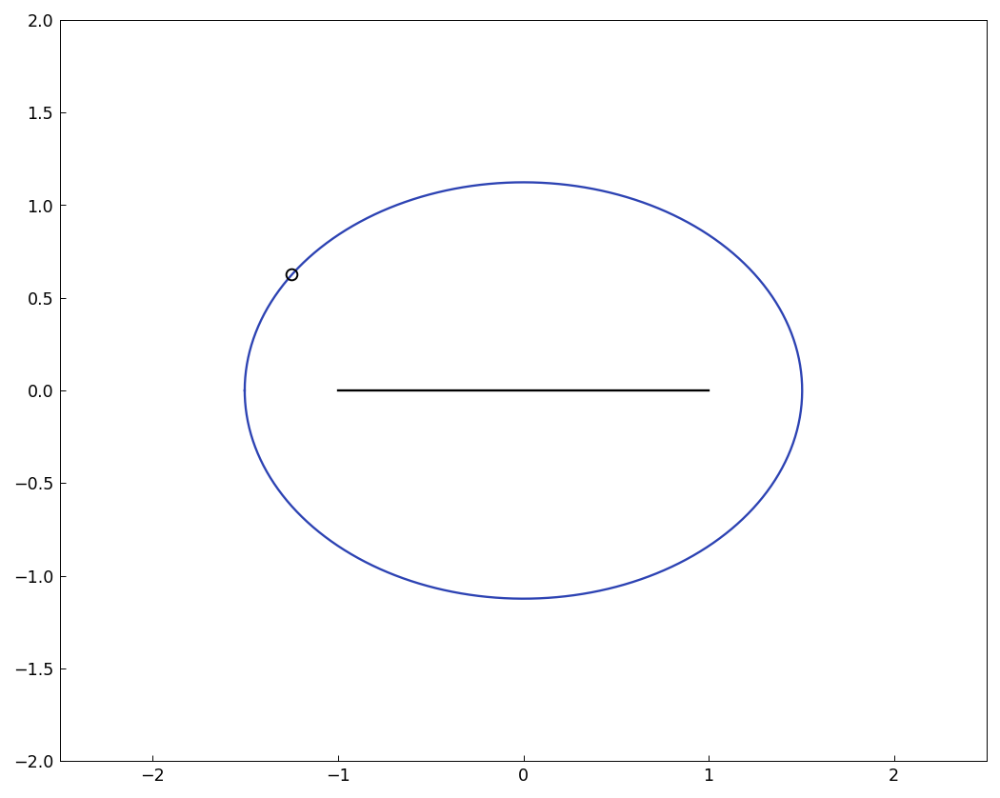
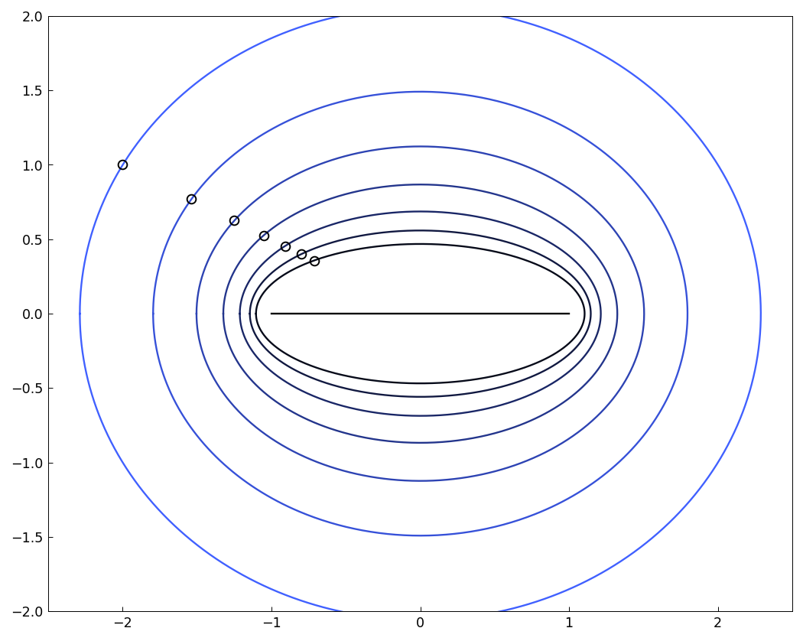

# A Taylor's theorem analogue for Chebyshev series

[Original MATLAB Chebfun example](https://www.chebfun.org/examples/temp/TaylorsTheorem.html)

(Chebfun example temp/TaylorsTheorem.m — Hrothgar and Anthony
Austin, February 2015)

Taylor series converge in discs; Chebyshev series converge in
_Bernstein ellipses_ — images of circles $z = re^{i\theta}$ under
the Joukowski map $z\mapsto (z+1/z)/2$.

## Convergence for an entire function

Truncated Chebyshev approximants of $\sin(x)$ on
$[-\pi/2, \pi/2]$ (thick green) on grids of size $5, 7, 9, \ldots$
converge everywhere — darker curves are denser grids:



## Convergence for a non-entire analytic function

$f(z) = \log|z - i|$ has a branch point at $z = i$ but is
well-behaved on the real axis:



A Chebyshev approximation on $[1.5, 2.5]$ (red), extrapolated
outside the interval:



An approximation from an interval more than twice as long (blue) is
hardly any better outside it:



The reason is the Bernstein ellipse of analyticity. Mapping the
singularity through the inverse Joukowski map gives the radii of
convergence, drawn as dashed lines:



```text
rho1 = 0.112637, radius of convergence d1 = 2.247679
rho2 = 0.279186, radius of convergence d2 = 2.316618
```

Expanding the interval didn't get us much!

## Bernstein ellipses and intervals of convergence

The ellipse for approximation of $f$ on $[0.4, 3.6]$, with the
transplanted singularity marked:



Increasing the interval radius pulls the transformed singularity
toward $[-1,1]$, shrinking the ellipse of analyticity — the darker
the ellipse, the larger the interval:



## References

1. L. N. Trefethen, _Approximation Theory and Approximation
   Practice_, SIAM, 2013.

---

*Replica script: [`examples/temp/taylorstheorem_replica.py`](https://github.com/ma-gilles/chebfunjax/blob/main/examples/temp/taylorstheorem_replica.py).
Original example copyright by The University of Oxford and The Chebfun
Developers.*
