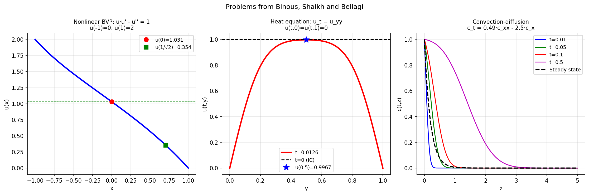

# Problems from Binous, Shaikh and Bellagi

**Original:** [temp/BinousShaikhBellagi](https://www.chebfun.org/examples/temp/BinousShaikhBellagi.html)
**Author(s):** Nick Trefethen, September 2014

---

An interesting paper by Binous, Shaikh, and Bellagi [1] explores various
problems that can be solved by Chebyshev spectral methods. Here we solve a
number of these problems with Chebfun. The equation numbers below refer to
their paper, and the authors are abbreviated as "BSB."

## 1. Split boundary value problem

The first problem BSB address is

$$uu' - u'' = 1, \quad u(-1) = 0,\; u(1) = 2.$$

BSB solve this by setting up a nonlinear system of equations based on
Chebyshev collocation, then solving the system by `FindRoot` in Mathematica
or `fsolve` in MATLAB. With Chebfun, the problem is expressed directly as a
`chebop` and solved via Newton iteration. The resulting plot agrees with
BSB Figure 1, and the values at $x=0$ and $x=1/\sqrt{2}$ match BSB Table 1.

## 2. Diffusion problem

Next BSB consider the PDE

$$u_t = u_{yy}, \quad u(t,0) = u(t,1) = 0,\; u(0,x) = 1,$$

and report the solution at time $t = 0.0126$ using `NDSolve` or `ode15s`. In
Chebfun, the matrix exponential approach (`expm`) solves this in one step.
The value at $y = 0.5$ matches BSB Table 2.

## 3. Arnold problem

The third problem describes evaporation of a liquid:

$$c_t = Ac_{zz} + Bc_{zz}, \quad c(t,0) = C,\; c(t,\infty) = 0,\; c(0,z) = 0,$$

where $A$, $B$, and $C$ are constants. BSB do not list their values, so this
problem is deferred.

## 4. Unsteady convection-diffusion problem

$$c_t = 0.49\,c_{xx} - 2.5\,c_x, \quad c(t,0) = 1,\; c(t,\infty) = 0,\; c(0,x) = 0,$$

with diffusion coefficient $D = 0.49$. The Chebfun `expm` approach is applied
on a truncated domain $[0,10]$ at time $t = 1.33$.

## 5. Falkner-Skan equation

The Falkner-Skan boundary-layer equation is

$$f''' + ff'' + \frac{\pi}{4}\bigl(1-(f')^2\bigr) = 0, \quad f(0) = f'(0) = 0,\; f'(\infty) = 1.$$

BSB solve this on $[0,4]$ and plot the derivative $f'$, which represents the
velocity profile. The Chebfun solution agrees.

## 6. Non-Newtonian Carreau fluid

BSB consider a shear-dependent viscosity model:

$$\mu(\dot\gamma) = 0.00204\,(1 + 0.04\,\dot\gamma^2)^{-1/4}.$$

The specific application is not detailed further.

## 7. Convection past an isothermal plate

A coupled system for the stream function $F(y)$ and temperature $T(y)$:

$$F''' + 3FF' - 2(F')^2 + T = 0, \qquad T'' + 30FT' = 0,$$

with boundary conditions $F(0) = F'(0) = 0$, $F'(\infty) = 0$,
$T(0) = 1$, $T(\infty) = 0$. The domain $[0,\infty)$ is approximated by
$[0, 2.5]$. BSB plot both the temperature and the velocity $F'$.

## Code

```python
from examples.temp.binous_shaikh_bellagi import run
run()
```



## References

1. H. Binous, A. A. Shaikh, and A. Bellagi, "Chebyshev orthogonal collocation
   technique to solve transport phenomena problems with Matlab and Mathematica,"
   *Computer Applications in Engineering Education*, 2014, pp. 1--10.