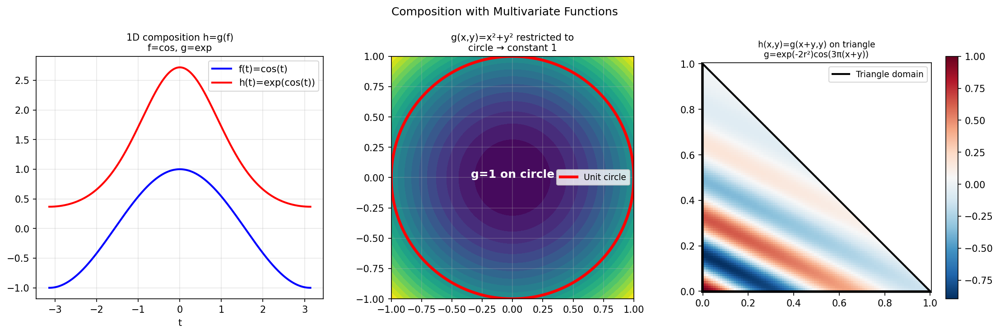

# Composition with Multivariate Chebfuns

**Original:** [temp/ChebfunComposition](https://www.chebfun.org/examples/temp/ChebfunComposition.html)
**Author(s):** Olivier Sete, February 2017

---

h = g(f): 1D and 2D function composition; restriction of g(x,y) to a curve f(t).

## Code

```python
from examples.temp.chebfun_composition import run
run()
```

## Output


