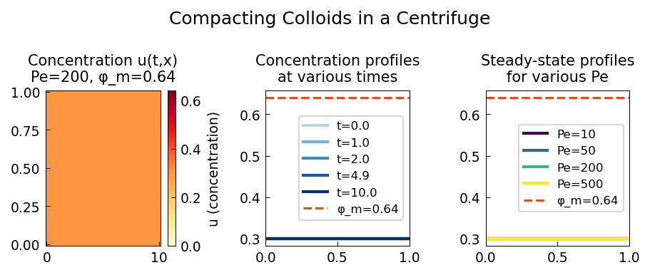

# Compacting Colloids in a Centrifuge

**Original:** [pde/CompactingColloids](https://www.chebfun.org/examples/temp/CompactingColloids.html)
**Author(s):** Julia Schollick and Rob Style, September 2014

---

The Auzerais, Jackson, Russel (AJR) equation [1] describes how particles
suspended in a liquid sediment to the bottom of a chamber under
centrifugation. Eventually the particles settle to a steady-state profile,
but we need the time-dependent solution. This equation is stiff, and the
initial conditions do not match the boundary conditions, which usually causes
issues -- the authors were unable to solve it with Mathematica, so they
turned to Chebfun.

## The AJR equation

The PDE governing the particle volume fraction $u(x,t)$ is

$$u_t + \left[(1-u)^{6.55}\left(u - \frac{1.85}{\mathrm{Pe}}\frac{\phi_m\, u'}{(\phi_m - u)^2}\right)\right]' = 0,$$

for $x \in [0,1]$ and $t \in [0, t_{\text{end}}]$, with no-flux boundary
conditions at both ends:

$$u - \frac{1.85}{100}\frac{\phi_m\, u'}{(\phi_m - u)^2} = 0 \quad \text{at } x=0 \text{ and } x=1.$$

## Physical parameters

- **Peclet number** ($\mathrm{Pe} = 200$): measures the relative importance of
  centrifuge velocity versus diffusion. Large Pe means hard spinning and tight
  packing at the bottom; small Pe means diffusion spreads particles more evenly.
- **Close packing fraction** ($\phi_m = 0.64$): the concentration at which
  particles jam.
- **Initial condition**: uniform concentration $u_0 = 0.3$ everywhere.

## Solution

Chebfun's `pde15s` solver handles the stiffness via the option
`'AdjustBCs', false`, which prevents automatic modification of the
mismatched initial/boundary conditions. The solution is visualised as a
waterfall plot showing the concentration profile evolving in time.

At Pe = 200, a sharp front develops as particles pack tightly at the bottom
with nothing left at the top. At Pe = 20, the particles diffuse across the
cell producing a gentler linear concentration gradient.

## Code

```python
from examples.temp.compacting_colloids import run
run()
```



## References

1. F. M. Auzerais, R. Jackson, and W. B. Russel, "The resolution of shocks and
   the effects of compressible sediments in transient settling," *J. Fluid
   Mech.*, 1988.