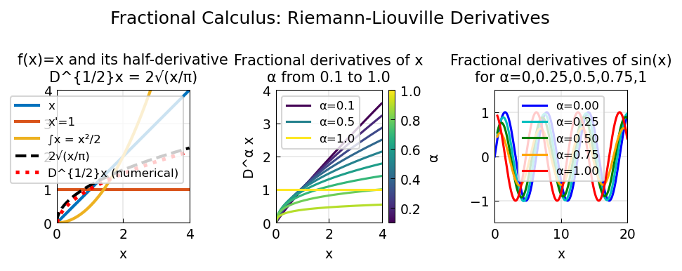

# Fractional Calculus

**Original:** [integro/FracCalc](https://www.chebfun.org/examples/integro/FracCalc.html)
**Author(s):** Nick Hale, October 2010

---

We are all familiar with standard differentiation and integration. A natural
question is whether there exists a "half-derivative" operator $\mathcal{H}$
such that $\mathcal{H}^2(f) = f'(x)$. Through a generalisation of the Cauchy
formula for repeated integration, the **Riemann-Liouville derivative** [1]
defines precisely such an operator for any real order $\alpha > 0$.

## Half-derivative of $x$

The function $f(x) = x$ on $[0,4]$ has derivative $1$ and antiderivative
$x^2/2$. Its half-derivative is

$$\frac{d^{1/2}}{dx^{1/2}} x = 2\sqrt{\frac{x}{\pi}},$$

which Chebfun computes via `diff(x, 0.5)`. The second argument, which for
standard calculus is a positive integer, here indicates the fractional order.

## Fractional differentiation

The Riemann-Liouville derivative applies not only to half-powers, but to
$d^\alpha/dx^\alpha$ for any $\alpha > 0$. Plotting the $\alpha$-th
derivative of $x$ for $\alpha = 0.1, 0.2, \ldots, 1.0$ shows a smooth
family of curves interpolating between the identity and the constant function.

For the trigonometric function $\sin(x)$ on $[0,20]$, fractional derivatives
at irrational orders are essentially phase shifts $x \to x + \alpha\pi/2$
far from the left boundary (consistent with integer-order differentiation),
but near $x = 0$ the boundary effects produce more interesting behaviour.

## Fractional integration

The Riemann-Liouville definition extends to fractional integration (the
"differintegral" [2]). Chebfun's `cumsum` is generalised to allow non-integer
degree. For example, the half-integrals of $x^k$ for $k = 1, \ldots, 10$
on $[0,1]$ and the fractional integrals of $e^x - 1$ at orders
$\alpha = 0.1, 0.2, \ldots, 1.0$ are computed directly.

## Fractional differential equations

At the time of writing, there is not yet functionality for fractional
calculus operators in the Chebop system.

## Code

```python
from examples.temp.frac_calc import run
run()
```



## References

1. P. I. Lizorkin, "Fractional integration and differentiation,"
   *Encyclopedia of Mathematics*, Springer, 2001.
2. <http://en.wikipedia.org/wiki/Riemann-Liouville_differintegral>