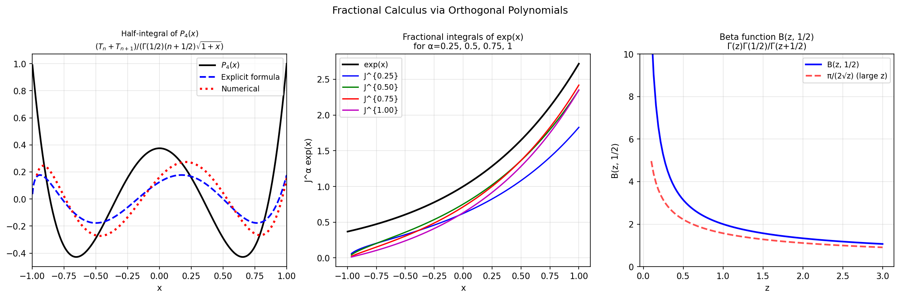

# Fractional Calculus (cont.)

**Original:** [integro/FracCalc2](https://www.chebfun.org/examples/integro/FracCalc2.html)
**Author(s):** Nick Hale, February 2015

---

In [1] we showed examples of fractional calculus in Chebfun. Here we give
details of the implementation. The key insight is that **fractional integrals
of Legendre and Jacobi polynomials (and "polyfractonomials") are known
explicitly**.

## Half-integral

The half-integral of a function $f$ is defined as

$$(J^{1/2}f)(x) = \frac{1}{\Gamma(1/2)}\int_{-1}^x \frac{f(t)}{\sqrt{x-t}}\,dt.$$

From the DLMF [2, (18.17.45)], the half-integral of a Legendre polynomial
$P_n$ is

$$(J^{1/2}P_n)(x) = \frac{T_n(x) + T_{n+1}(x)}{\Gamma(1/2)\,(n+\tfrac{1}{2})\,\sqrt{1+x}},$$

where $T_n$ denotes the Chebyshev polynomial of degree $n$.

For a function expanded in Legendre polynomials,
$f(x) = \sum_{n=0}^N c_n P_n(x)$, the half-integral becomes

$$(J^{1/2}f)(x) = (1+x)^{-1/2}\sum_{n=0}^{N+1} b_n T_n(x),$$

where the $b_n$ are obtained from the $c_n$ by the formula above.

## General fractional integrals

The implementation extends to fractional integrals of Jacobi
"polyfractonomials" of the form

$$\mathcal{P}_n^{(0,\beta,\mu)}(x) := (1+x)^{\beta+\mu} P_n^{(-\mu,\,\beta+\mu)}(x),$$

with the fractional integral given by

$$(J^\mu \mathcal{P}_n^{(0,\beta,0)})(x) = \frac{B(\beta+n+1,\,\mu)}{\Gamma(\mu)}\,\mathcal{P}_n^{(0,\beta,\mu)}(x),$$

where $B$ is the Beta function. The algorithm therefore computes Jacobi
coefficients (via `jaccoeffs`), scales by Beta and Gamma functions, and
converts back to Chebyshev coefficients (via `jac2cheb`).

## Fractional derivatives

Fractional derivatives are defined via fractional integrals. Two conventions
exist:

- **Caputo**: differentiate $\lceil\mu\rceil$ times, then compute the
  $(\lceil\mu\rceil - \mu)$-th fractional integral.
- **Riemann-Liouville**: compute the $(\lceil\mu\rceil - \mu)$-th fractional
  integral, then differentiate $\lceil\mu\rceil$ times.

These two definitions produce different results in general, but both satisfy
the composition property $D^{1-\alpha}(D^\alpha f) = f'$.

## Code

```python
from examples.temp.frac_calc2 import run
run()
```



## References

1. Chebfun Example [integro/FracCalc](frac_calc.md)
2. NIST Digital Library of Mathematical Functions, <http://dlmf.nist.gov/>,
   Release 1.0.9 of 2014-08-29.
3. Chebfun Example [cheb/FastChebyshevLegendreTransform](https://www.chebfun.org/examples/cheb/FastChebyshevLegendreTransform.html)