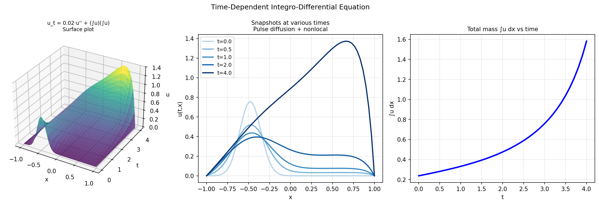

# Time-Dependent Integro-Differential Equation

**Original:** [pde/IntegroDiffT](https://www.chebfun.org/examples/pde/IntegroDiffT.html)
**Author(s):** Nick Hale, October 2010

---

u_t = 0.02u'' + (∫u)(∫_a^x u): nonlocal coupling drives growth of total mass.

## Code

```python
from examples.temp.integro_diff_t import run
run()
```

## Output


