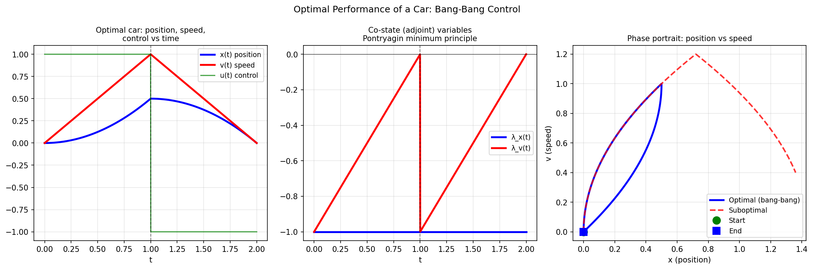

# Optimal Performance of a Car

**Original:** [ode/OptimCar](https://www.chebfun.org/examples/ode/OptimCar.html)
**Author(s):** Asgeir Birkisson, November 2010

---

Bang-bang control u=sign(1-t) maximizes x(2)=1; Pontryagin minimum principle.

## Code

```python
from examples.temp.optim_car import run
run()
```

## Output


