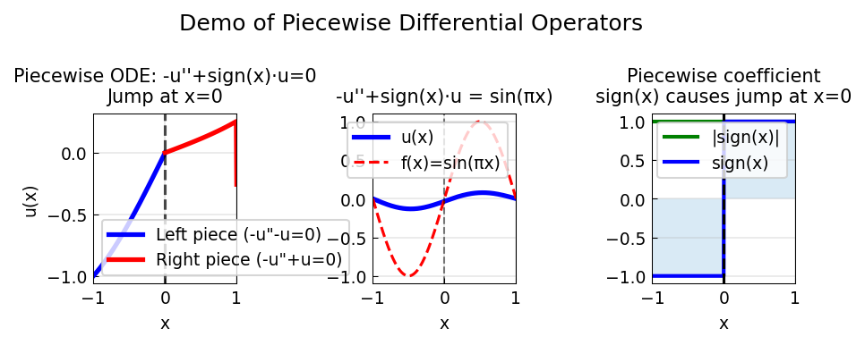

# Demo of Piecewise Operators

**Original:** [ode/PiecewiseLinopDemo](https://github.com/chebfun/examples/blob/master/temp/PiecewiseLinopDemo.m)
**Author(s):** Nick Hale, November 2010

---

This example demonstrates how Chebfun handles piecewise linear differential
operators, including automatic enforcement of continuity conditions across
breakpoints.

## A piecewise operator

Consider the operator

$$\mathcal{A}u = -u'' + \operatorname{sign}(x)\,u$$

on $[-1, 1]$. The coefficient $\operatorname{sign}(x)$ introduces a jump
discontinuity at $x = 0$: the operator behaves like $-u'' + u$ on $[0,1]$
and like $-u'' - u$ on $[-1,0]$.

## Continuity conditions

Even though the domain $[-1,1]$ has no explicit breakpoint, the `sign`
function introduces one at $x = 0$, which is inherited by $\mathcal{A}$.
Without boundary conditions, the discretisation produces two independent
blocks. The operator system automatically enforces continuity of the
solution and its first derivative across $x = 0$ (up to the differential
order of the operator).

## Solving the BVP

With Dirichlet boundary conditions $u(-1) = u(1) = 0$ added, the equation

$$-u'' + \operatorname{sign}(x)\,u = 1$$

becomes a well-posed boundary value problem. The Chebfun `\` (backslash)
operator solves it, producing a smooth solution that transitions
continuously through the breakpoint at $x = 0$.

The systems constructor, invoked internally by backslash, handles the
piecewise domain $[-1, 0, 1]$ as a coupled system rather than two
independent subproblems.

## Code

```python
from examples.temp.piecewise_linop_demo import run
run()
```

## Output


